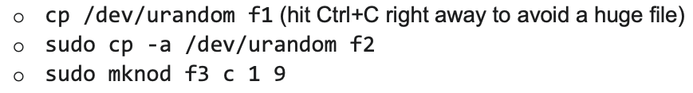

Here is the [link](https://homeostasis.scs.carleton.ca/wiki/index.php/COMP3000_Operating_Systems_2024W#Tutorial_Instructions) to all Winter 2024 tutorial resources.

## Tutorial 6

### Links

- [Tut6 - instructions](https://homeostasis.scs.carleton.ca/wiki/index.php/COMP3000_Operating_Systems_W24:_Tutorial_6)
- [Tut6 - explanation.pdf](https://github.com/voidranjer/james-portfolio/files/15019335/Tut6.-.explanation.pdf)

### Concurrency concepts

- `3000pc-fifo`: Based on **messaging**. Communication is "outsourced" to the OS abstraction, and output order is **deterministic**.
- `3000pc-rendezvouz`: Based on **shared memory**. Output order is seemingly random.

### Randomization

```c
srandom(<seed>)
```

Use `/dev/urandom` as the seed for `srandom()`. `/dev/urandom` is a **character device** and not a _block device_ because it provides access to a stream of characters (bytes) rather than a fixed-size block of data.

## Tutorial 7

### Links

- [Tut7 - instructions](https://homeostasis.scs.carleton.ca/wiki/index.php/COMP3000_Operating_Systems_W24:_Tutorial_7)
- [Tut7 - explanation.pdf](https://github.com/voidranjer/james-portfolio/files/15020567/Tut7.-.explanation.pdf)

### 2 ways to access a device file

:::tip Aside

- Recall that `/dev/urandom/` is a character device that generates a pseudo-random stream of data based on environmental noise. Unlike `/dev/random`, it **does not** block when the entropy pool is depleted; instead, it continues to generate pseudo-random data.

:::



- `cp /dev/urandom f1` tries to read from the device node (invoking the driver's `read()` function) and write to another newly-created regular file. As `/dev/urandom` never sends an end-of-file (EOF), you will get infinite
data, hence filling up your disk _(that’s why you must stop it right away)_.
- `sudo cp -a /dev/urandom f2` and `sudo mknod f3 c 1 9` are equivalent, because "`-a`" preserves all properties of the device inode _(yes, devices have inodes too)_, and you are creating an identical inode copy (equivalent to calling `mknod`, hence the need for root). It's kind of like creating two hard links to the same file's data blocks. (having multiple inodes that point to the same blocks on the storage device).

### Steps to create a device driver

1. Register the major number.
2. Create a device.
3. Register file operations to event handler functions.
4. Subsequently, when events happen in runtime, the kernel invokes the registered functions from the driver.
