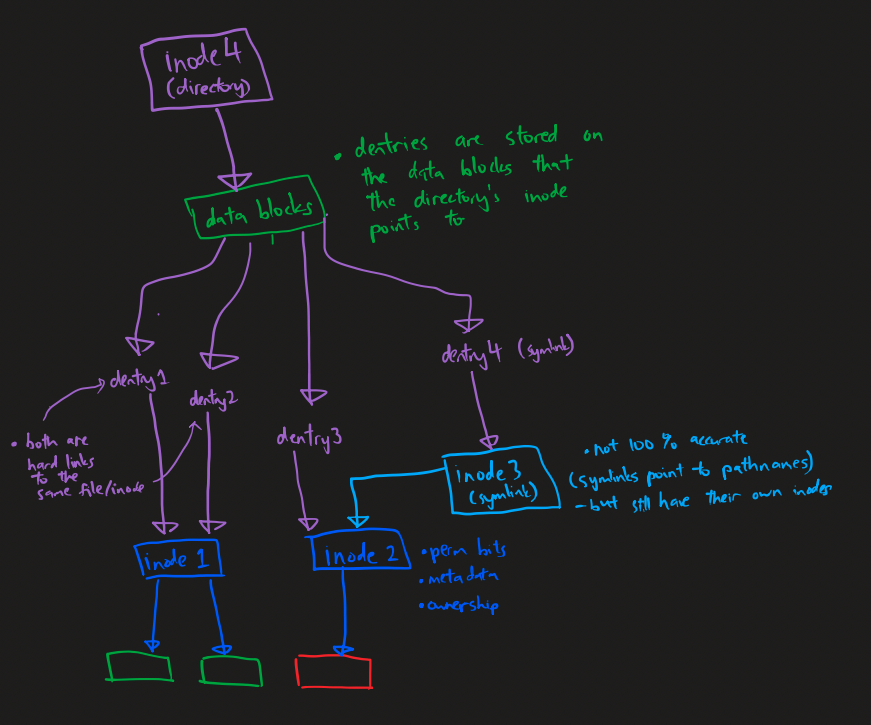
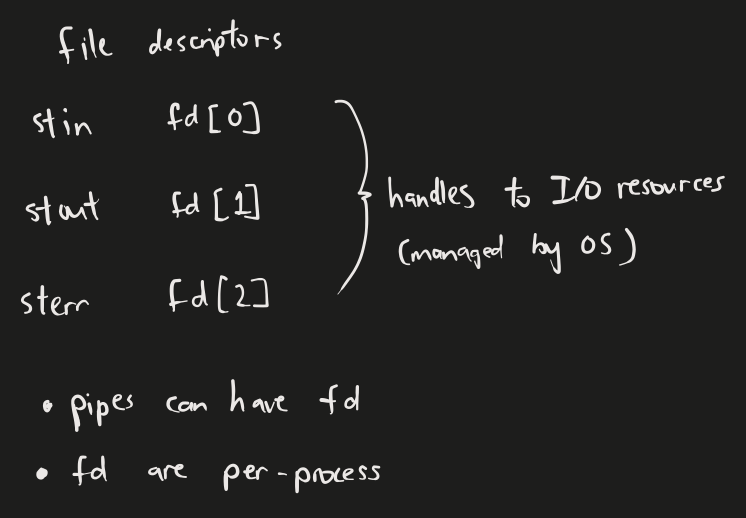

Lecture 11, Lecture 13

<video
  style={{ width: "100%" }}
  src="https://cfvod.kaltura.com/pd/p/2011531/sp/0/serveFlavor/entryId/1_39852zl9/v/11/ev/5/flavorId/1_uahre29o/name/a.mp4/seg-179-v1-a1.ts?Policy=eyJTdGF0ZW1lbnQiOlt7IlJlc291cmNlIjoiaHR0cHM6Ly9jZnZvZC5rYWx0dXJhLmNvbS9zY2YvaGxzL3AvMjAxMTUzMS9zcC8wL3NlcnZlRmxhdm9yL2VudHJ5SWQvMV8zOTg1MnpsOS92LzExL2V2LzUvZmxhdm9ySWQvMV91YWhyZTI5by9uYW1lL2EubXA0LyoiLCJDb25kaXRpb24iOnsiRGF0ZUxlc3NUaGFuIjp7IkFXUzpFcG9jaFRpbWUiOjE3MTM0ODM4NDF9fX1dfQ__&Signature=Vc0sxxVti~QgnwGx6Fc4a1XtctF8HRyASKBKbRmPkKL3ZhR7Yg53cn0W9LAU68W-voOQnhHwatRKE-3T81DUPB8X4fOPH8Ltjv6KV9u3~PBxinLZay98~KfGUPUJJ9997Rc3kCp4KPu4LZd~ueypl7gSNFiJEyjvjkFRSI-ubhSz7-ikND0Ux93ApqItOjRlZiEY25CSEbzb~ZBHlVdir7mROql7DqUMAI9284uFJvvv8a0Zc437ad7FwuB6CsyF7wPA7hmKj9yd2DTcxuXB-2oSrDynqoGYm1-KWAinniCKvhg5yVdu2jjCSGpcBBQZuz1SNAiy3R6wE6T7Ic1Fsg__&Key-Pair-Id=APKAJT6QIWSKVYK3V34A"
  controls
/>

## Slides

[COMP3000-ConcurrencyA-annotated.pdf](https://github.com/voidranjer/james-portfolio/files/15018652/COMP3000-ConcurrencyA-annotated.pdf)

## Concurrency

:::tip Aside

- **Threads** share memory space, whereas **processes** do not.
- Threads can use **shared memory** to communicate with one another, while processes may have to use **messaging**.

:::

### Pipes (messaging)

- **Unnamed pipes (`pipe()`)**
  - Backed by in-memory buffers – **no inodes**. ❌
  - Limited scope: only accessible within the same process (✅ children processes, ❌ other processes), (✅ `fork`, ❌ `exec`).
  - Limited lifespan: terminated with the starting process.
- **Named pipes (`mkfifo()` or `mknod()`)**
  - Backed by file systems – has **inodes**. ✅ _(a "file" gets created)_
  - Accessible by multiple processes (via the file handle).

### The 3 modes of `mmap()` (shared memory) {#mmap}

1. Allocate memory: (tut2) `MAP_PRIVATE|MAP_ANONYMOUS` – private to one process
2. Allocate shared memory: (tut6) `MAP_SHARED|MAP_ANONYMOUS` - shared between processes
3. Map a file into memory: (tut5) `MAP_SHARED` - shared between processes and backed by a file

:::tip Aside

- `malloc`  **does not** initially make syscalls, as it only has to allocate **within the current process's address space**.
- However, `malloc` is forced to use these syscalls to expand the process's address space **when memory runs out**: `brk`/`sbrk` for small allocations and `mmap` for large allocations.
- The specific threshold can be viewed using `man malloc`

:::

### Performance Overhead Tradeoffs

**Messaging**

- Example of messaging systems: _pipes, signals, sockets, etc_
- Easier to use
- Third-party OS abstraction mechanisms coordinate access to shared resources
- At the cost of performance
  - Cost of **moving data around** _(proportional to data size)_
  - **Context switching**: The OS layer has to constantly step in, causing extra switching of the execution context (state of CPU registers have to be loaded and unloaded to and from RAM when switching between running the kernel vs running the program). This is fixed and **not proportional** to the data size (saving and restoring the CPU state remain constant regardless of the data size).

## Concurrency Issues

Operations that update shared resources lack **atomicity** because there are no **per-purpose CPU instructions** (each purpose requires multiple instructions to be achieved), opening up a chance for a third party to interject during the instruction sequence of a "purpose", leading to inconsistencies. _(Manufacturers can only build in so many instructions into CPUs)_

We solve this problem using mutual exclusion.

## Semaphores (Mutexes and Conditional Variables)

Integer values that are decremented by `sem_wait()` and incremented by `sem_post()`.

Processes **wait** when the value is **< 0**, and **runs** when the value is **≥ 0**.

Modes:

- Mutex mode: set initial value to **1**
  1. Thread A spins up. (calls `sem_wait()`, semaphore goes from `1` to `0`)
  2. Thread A starts its job. (because the sem value is `0`, Thread A runs)
  3. Thread B spins up. (calls `sem_wait()`, semaphore goes from `0` to `-1`)
  4. Thread B waits for Thread A to finish its job. (because the sem value is `-1`, Thread B waits.)
  5. Thread A finishes its job. (calls `sem_post()`, semaphore goes from `-1` to `0`)
  6. Thread B starts its job. (because the sem value is `0`, Thread B runs)
- Condition variable: set initial value to **0**
  1. Thread A spins up. (calls `sem_wait()`, semaphore goes from `0` to `-1`)
  2. Thread A waits for _"condition"_ to be satisfied. (because the sem value is `-1`, Thread A waits.)
  3. Some other thread finishes its job, and calls `sem_post()`, satisfying the condition for Thread A to begin.
  4. Thread A starts and completes its job. (because sem value is now `0`)

## 4 Necessary conditions for deadlocks

The four necessary conditions for deadlock, known as the Coffman conditions, are as follows:

### Mutual Exclusion:

- At least one resource must be held in a non-sharable mode, meaning only one process can use the resource at any given time.

### Hold and Wait:

- A process must hold at least one resource and be waiting to acquire additional resources that are currently held by other processes.

### No Preemption:

- Resources cannot be forcibly taken away from processes that hold them. A process must voluntarily release any resources it holds before it can request additional resources.

### Circular Wait:

- There must exist a circular chain of two or more processes, each of which is waiting for a resource held by the next process in the chain.
  When all four of these conditions are present simultaneously in a system, it can lead to a deadlock situation where no process can proceed because each is waiting for a resource that is held by another process in the deadlock. Deadlocks can cause system-wide resource starvation and can be challenging to detect and resolve.

Insufficient mutexes -> logic/data corruption, while overdoing mutexes -> deadlocks. The trick is to find a good middle ground.

**Timeout** is also a good way to deal with deadlocks _(preemption)_.

## Extra Notes

