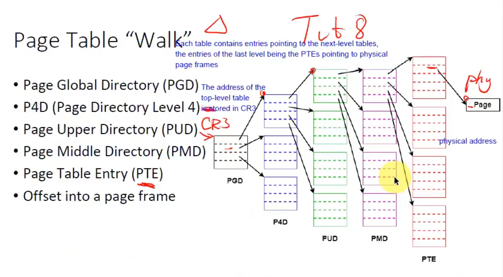
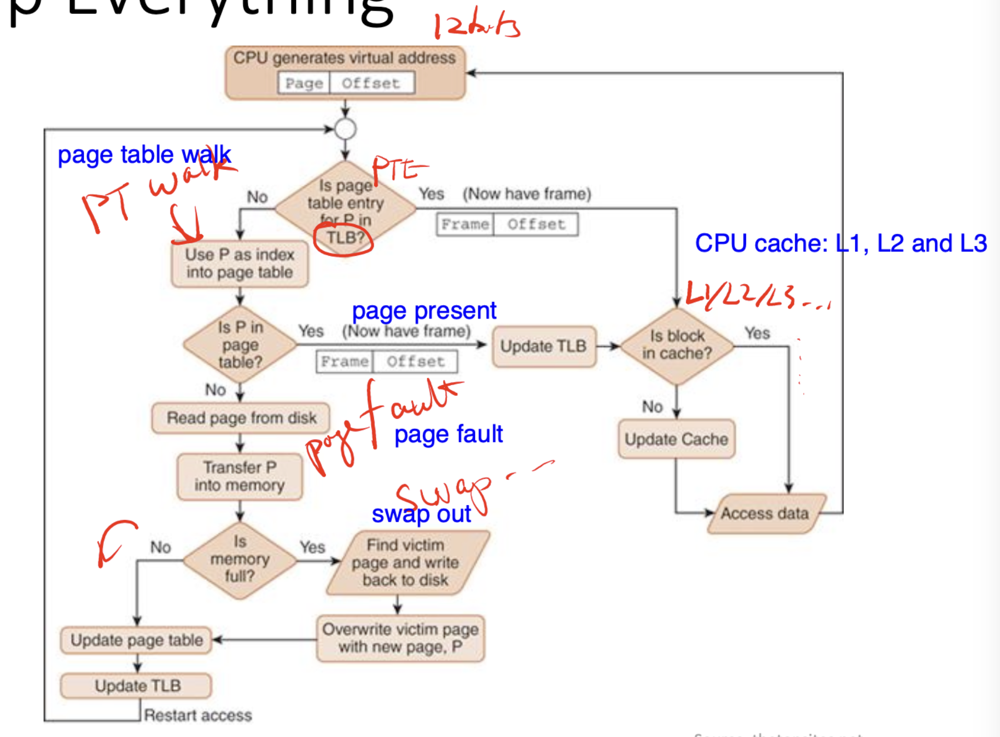

Lecture 16, Lecture 17

## Virtual vs Physical Memory

- Understand the difference between a "process view" of memory and the "kernel view" of memory.
- **Process View**
   - Each process sees only its own memory, with addresses starting from 0. (virtualized memory)
   - Address space split into these sections: code, data, stack, heap, etc...
   - `malloc()` to manage per-process memory.
- **Kernel View**
   - `mmap()` to map outside resources into per-process memory. (see [Concurrency](../03-concurrency/index.md#mmap) for more details on `mmap()`)
   - **Kernel** has access to **global memory** and works together with the hardware **(Memory Management Unit/MMU)** to perform **virtual ↔ physical address translation**. (read more in **Virtual-physical translation** section below)
 
- Virtual memory can be way larger than the actual physical memory. Due to "swapping" - **using storage space as memory**
- Virtual memory max size is limited by the size of addresses/pointers (a.k.a **"bitness"**, 64-bit/32-bit addresses).
- Physical memory max size is limited by cost/power/space/physical constraints.

:::tip Aside

- `malloc`  **does not** initially make syscalls, as it only has to allocate **within the current process's address space**.
- However, `malloc` is forced to use these syscalls to expand the process's address space **when memory runs out**: `brk`/`sbrk` for small allocations and `mmap` for large allocations.
- The specific threshold can be viewed using `man malloc`

:::

## Pages vs Blocks (Memory vs Storage)

- ⭐️ **Memory**: pages, page frames
   - OS abstracts fragmented **pages** into seemingly **continuous** memory _(you can request for any arbitrary-sized memory bigger or smaller than the page size when using `malloc()`)_
- ⭐️ **Storage**: blocks, data blocks
   - OS abstracts **blocks** into **files**.
 
## Virtual-physical translation

- Huge performance overhead if done by software
- Kernel software and hardware (MMU) have to cooperate
   - Kernel (software): Set up page tables, page fault handling, etc
   - MMU (hardware): Caching, computation. Heavy-lifting done by hardware instead of software.
- Translation done at the granularity of a page (smallest allocatable unit of memory)

## Multi-level Paging

### Design choices
- 🔽 Smaller page size
   - **Page tables** are used to map memory addresses to pages.
   - Having pages that are too small means **we need a lot more pages** to store the same amount of data. Meaning, the page tables will **need to store way more memory addresses** (could be 32/64-bit per address).
   - This is further multiplied by the number of processes (memory addresses are per-process).
   - Page tables become too big, infeasible to implement.
- 🔼 Larger page size
   - Risk of **internal** fragmentation: data doesn't fully populate a page leading to wasted space
   - On the other hand: Not having **fixed page sizes** leads to external fragmentation (unusable gaps between allocated chunks).

### Page Table Entries (PTE)

- Remember the problem where page tables become too big in the point above? ⬆️
- Using linear page tables has the same issue.

- Instead of directly allocating a linear table of mem addresses, we can use multi-level page tables
- The **last-level** of pages are PTEs **pointing to physical page frames**.
- The **root level page** is stored in the CPU register: **CR3**
- **Advantage:** Mem addresses do not have to be allocated pre-emptively. The upper-level pages can store the next lower-level page address in one slot, and the remaining unallocated slots can remain **null**. (this saves a lot of space because we do not pre-maturely allocate mem addresses - they're allocated on demand).

> Remember that the "wasted space" we're talking about here refers to space used to store **memory addresses** (a.k.a pointers), and not the actual memory content itself.

- **Page tables are per-process (per address space)**
- **The kernel has also its own page table**

### What's stored in a PTE?

- Metadata about the target page.
   - RW (read-only?)
   - User or kernel owned page?
   - NX (no-execute)
   - 💾 **Swapping** metadata
      - **dirty bit**: indicates whether or not the target page has been modified, used to determine if changes should be reflected to storage when swapping out from memory to storage
      - **valid/invalid (present/absent) bit**: indicates if the target **virtual** page is **physically** loaded or not (pages that haven't been used in a while may be off-loaded to storage)
      - **accessed bit**: kernel batch sets all PTE access bits to `0` at a known interval, then when a page is accessed, the bit is set to `1`. Then, after some number of operations, the kernel can use the Least Recently Used (LRU) clock algorithm to pick pages that haven't been frequently accessed, and offload to swap.
      - > Ideally we would use timestamps to measure access frequency, but the computational overhead is too high.
- Equiv to the `rwx` (read/write/exec) metadata bits stored on **inodes** (when dealing with storage).
- **Mechanism for security**: The kernel sets these access bits up, then hands over the CPU execution context to a process _(remember pre-emptive computing, limited direct execution)_. These bits then allow the hardware to inform and "wake up" the kernel to handle processes trying to perform illegal operations (e.g. writing to a page that it has no access to). What usually follows is the kernel will then terminate these rebellious processes.

### Translation Lookaside Buffer (TLB)

- Cache for PTEs (to increase performance. TLB speeds are way faster than regular memory)
- Only caches PTEs (the last-level on multi-level page tables), meaning if a PTE exists in the TLB, we do not have to perform the full page table walk to get to it.
- Transparent on x86 (you cannot see/manipulate the TLB, all done automatically by hardware)

:::tip Fun fact

The TLB is used extensively in the Meltdown and Spectre exploit, link to explainer video in the [fun fact section](#fun-fact) below!

:::

## Page caches

- **NOT** the same as TLBs.
- This caches **regular content** from files/devices into memory. (not mem addresses)
- Remember that when writing characters to files/storage blocks (in Java, Python, or anything else), usually there's a buffer that stores these changes and only gets reflected to the backing storage/device once in a while using stdout.flush (or some other buffer flush commands).

## Page faults

- When trying to access a page that isn't present (remember present/absent bit from the points above ⬆️)
- The hardware triggers a fault, then calls the kernel to handle this fault.
- The kernel will either:
   - ❌ Segmentation fault: throw an exception (illegal memory access)
   - 💾 Fetch requested page from storage (from swap), as the hardware isn't programmed to handle the semantics of where to find the swap data.
 
## Other concepts

- Thrashing: When a system has oversubscribed the number of swap pages (storage-backed memory), and the CPU spends more time handling page faults than doing actual work.
- Out-of-memory Killer (OOM): A mechanism that kills processes as a last resort (e.g. to cope with thrashing)

## Gluing up everything

---

## Tutorial 8 (also on mm)

Prof briefly brushes over the tutorial.

---

## Fun fact: Meltdown and Spectre (not in exam) {#fun-fact}

<iframe
  width={560}
  height={315}
  src="https://www.youtube.com/embed/YRohz9VO1YY?si=_R7ffL8N6_GzaTrF"
  title="YouTube video player"
  frameBorder={0}
  allow="accelerometer; autoplay; clipboard-write; encrypted-media; gyroscope; picture-in-picture; web-share"
  referrerPolicy="strict-origin-when-cross-origin"
  allowFullScreen
/>

TLB (Translation Lookaside Buffer) and PTE (Page Table Entry) are indeed involved in the infamous Meltdown exploit.

Meltdown is a hardware vulnerability that exploits out-of-order execution and speculative execution mechanisms present in modern CPUs. It allows an attacker to read arbitrary kernel memory locations, including sensitive data, from unprivileged user-space processes.

Here's how TLB and PTE are involved:

1. **Virtual Memory**: Modern operating systems use virtual memory to isolate processes from each other and from the kernel. Each process has its own virtual address space, which is mapped to physical memory using page tables.

2. **TLB**: The TLB is a hardware cache that stores recently accessed virtual-to-physical address translations. It speeds up memory access by providing fast lookups for translations without needing to consult the page table.

3. **Out-of-Order Execution**: CPUs use out-of-order execution to improve performance by executing instructions ahead of time, even if the outcome of those instructions is uncertain.

4. **Speculative Execution**: CPUs also use speculative execution to predict the outcome of branches and execute instructions speculatively before the branch outcome is known.

5. **Meltdown Exploit**: The Meltdown exploit leverages the combination of out-of-order execution and speculative execution to access kernel memory from user-space processes.

   - The attacker's process triggers a speculative read of kernel memory by attempting to access a kernel memory address from userspace.

   - Even though the access should be denied due to memory protection mechanisms, the CPU speculatively fetches the data and loads it into a register.

   - The CPU also speculatively updates the TLB with the virtual-to-physical address translation, based on the speculative read.

   - If the speculative read results in an exception (e.g., due to access violation), the CPU discards the results of the speculative execution. However, the TLB may still contain the virtual-to-physical address translation for the kernel memory accessed speculatively.

   - By measuring the **timing** of subsequent memory accesses, the attacker can infer the contents of the kernel memory indirectly, even though the speculative read should have been denied.

In summary, while TLB and PTE themselves are not vulnerabilities, they play a crucial role in the operation of CPUs and are exploited by attacks like Meltdown to gain unauthorized access to sensitive data. Meltdown exploits the speculative nature of modern CPUs and the interaction between TLB, PTE, and speculative execution to leak kernel memory contents to unprivileged user-space processes.

