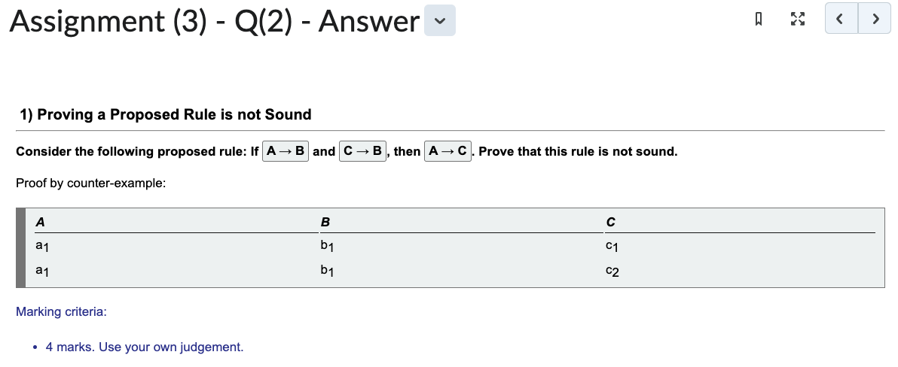
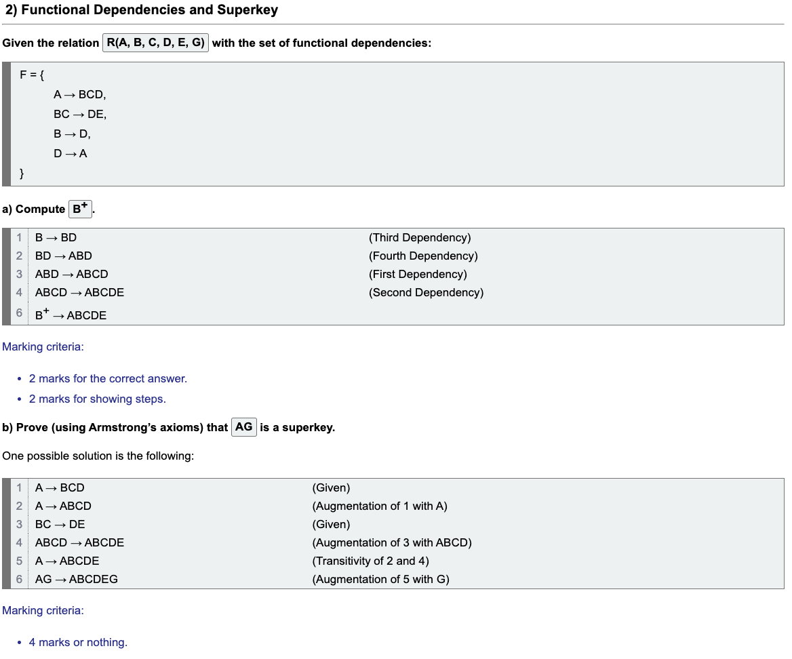
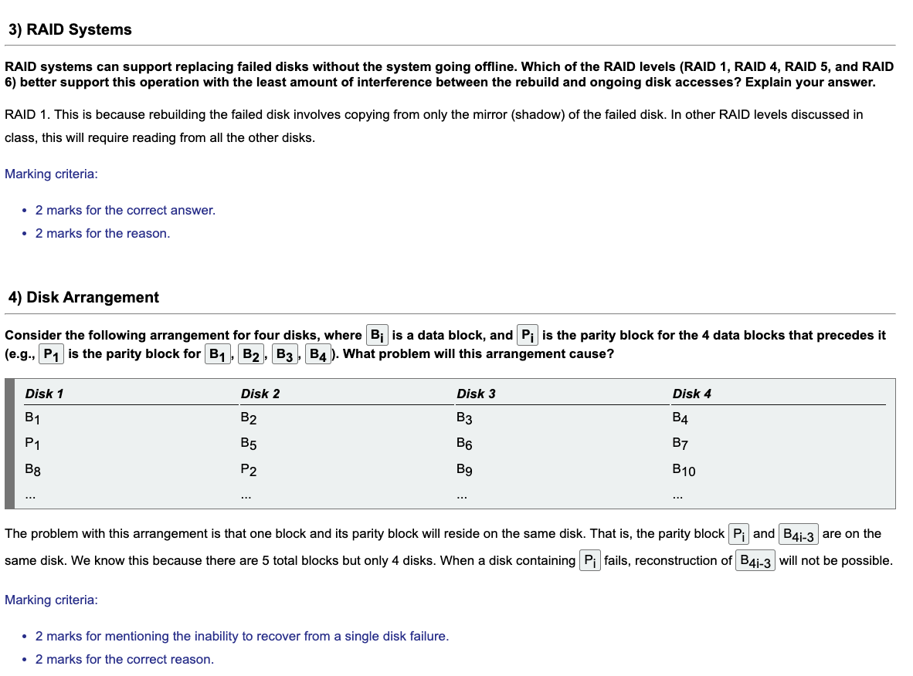

## Functional Dependencies

:::tip Aside

- Quick way to remember: **studentID (PK) $\rightarrow$ studentName**.
- **studentID** determines **studentName**.

:::

| **studentID** | **studentName** | **courseCode** |                                              valid?                                             |
|:-------------:|:---------------:|:--------------:|:-----------------------------------------------------------------------------------------------:|
|     stu001    |       Bob       |    COMP 3000   |                                                ✅                                                |
|     stu002    |       Jane      |    COMP 3005   |                                                ✅                                                |
|     stu003    |       Bob       |    COMP 1405   |                                                ✅                                                |
|     stu003    |       Bob       |    COMP 1406   |                                                ✅                                                |
|     stu001    |      James      |    COMP 2402   | ❌ Contradicts row 1. If this row exists, then studentID $\rightarrow$ studentName is **false**. |

## Trivial Functional Dependencies

- A functional dependency $X \rightarrow Y$ is **trivial** if $Y \subseteq X$.
- $XY \rightarrow Y$ is **trivial**.
- $Y \rightarrow XY$ is **non-trivial**.

## Armstrong's Axioms

1. **Reflexivity**: If $XY \rightarrow X$, then $X \rightarrow Y$.
2. **Augmentation**: If $X \rightarrow Y$, then $XZ \rightarrow YZ$.
3. **Transitivity**: If $X \rightarrow Y$ and $Y \rightarrow Z$, then $X \rightarrow Z$.
4. **Union**: If $X \rightarrow Y$ and $X \rightarrow Z$, then $X \rightarrow YZ$.
5. **Decomposition**: If $X \rightarrow YZ$, then $X \rightarrow Y$ and $X \rightarrow Z$.
6. **Pseudotransitivity**: If $X \rightarrow Y$ and $WY \rightarrow Z$, then $WX \rightarrow Z$.

## Superkeys and Candidate Keys

$
R = (A, B, C, G, H, I) \\
(AG)^+ = ABCGHI
$

- **Superkey**: All attributes in the relation are determined by this key. In this example, $AG$ is a superkey.
- **Candidate Key**: A small subset of attributes that each individually uniquely determine all other attributes in the relation. In this example, if $AG$ is a candidate key, it has to mean A and G can uniquely determine all other attributes in the relation (individually).

## Assignment 3

