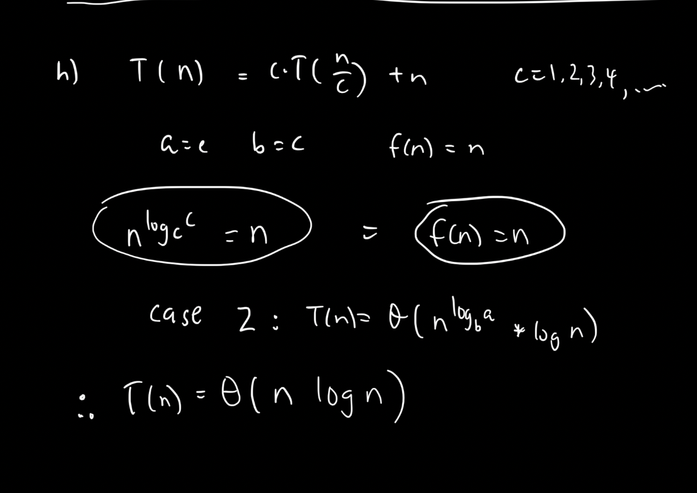

[Assignment 1.pdf](./ass1.pdf)

## Question 1

### Part 1 {#part-1}

```python
def find_two_smallest(input_array):
    if len(input_array) < 2:
        return None, None

    smallest = float('inf')
    second_smallest = float('inf')

    # This algorithm assumes that the question is asking for two smallest numbers excluding duplicates.
    # i.e. get two UNIQUE smallest numbers

    for element in input_array:
        if element < smallest:
            second_smallest = smallest
            smallest = element
        elif element < second_smallest and element != smallest:
            second_smallest = element

    return smallest, second_smallest

print(find_two_smallest([2,1,4,0,3,9]))
```

The algorithm I made is given as seen above. It is linear time, i.e., it runs in $ O(n) $ time. **Given that we only care about comparisons** - and we will assume that the worse case happens for every iteration of the `for` loop - there are two comparisons each iteration:

- **Comparison #1** – `if element < smallest:`
- **Comparison #2** – `elif element < second_smallest`
- _(we ignore the `element != smallest` comparison, because we assume that the question did not ask for the 2 "unique" smallest...)_

:::tip Important Note

- This solution assumes that we **do not care** about the time taken for variable assignments.
- I'm also ignoring the initial array length check `if len(input_array) < 2` in this analysis, because I have a feeling that not everyone's solutions will include this check, and **I don't want to confuse**.

:::

So, we have gathered that there are **2** comparisons that run in each iteration of the for loop, in the worse case. Now we figure out how many iterations the for loop goes through in the worse case:- the for loop starts with the **first element** of the `input_array`, and terminates with the **last element**. Since there are `n` elements, we can say the for loop runs with `n` iterations.

**Conclusion:** This algo runs with exactly $2n$ comparisons.

### Part 2

```python
def find_two_largest(input_array):
    if len(input_array) < 2:
        return None, None

    largest = float('-inf')
    second_largest = float('-inf')

    for element in input_array:
        if element > largest:
            second_largest = largest
            largest = element
        elif element > second_largest and element != largest:
            second_largest = element

    return largest, second_largest

print(find_two_largest([2,1,4,0,3,9]))
```

This algo is essentially the same one as above, with the differences being in the initialization (where we point at the negative direction ($ -\infty $)), and in the comparisons (`>` instead of `<`).

### Part 3

To be able to re-use the same algo in [Part 1](#part-1) (while remaining in linear time), we can transform the input array by multipling each element by $ -1 $. For example, an array $[1, 5, 3, 7]$ will become $[-1, -5, -3, -7]$. Then, we use the same algorithm in [Part 1](#part-1) by plugging this negative array instead. This will return the two largest numbers, but we will have to remember to re-multiple the results with $ -1 $ to obtain the original array elements (in non-negative form).

### Part 4

The algo:

```

find_median(A):
n := length(A)

while n > 2:
    min1, min2 = find_two_smallest(A[1...n])
    max1, max2 = find_two_largest(A[1...n])

    A.remove(min1)
    A.remove(max1)
    n := n - 2

    if n > 2:
        A.remove(min2)
        A.remove(max2)
        n := n - 2

// edge case: even number of elements
if n == 2:
    return (A[1] + A[2]) / 2

return A[1]

```

The time complexity is $ O(n^2) $, because the outer while loop runs $ n $ times, and each iteration executes `find_two_smallest`, `find_two_largest`, and `A.remove()`, which all run at $ n $. But because the relationship of these operations embedded inside the while loop have an additive relationship ($ n + n + n = 3n $), the Big-O asymptotic complexity is still just $ O(n^2) $.

If we really care about the constants, however, we could further optimize this algorithm to create a third buffer array (or even better, a **HashSet**) with the size of $n$. And instead of performing removes in every iteration which requires a ton of shifting and moving around of elements to shrink the array, we can instead just maintain a list of "exclusions", and look up the exclusion map before operating on any of the elements when iterating the array, until we are down to 1 or 2 elements left out of the exclusion map (the median values).

### Part 5

In order to solve this problem using loop invariant, we have to determine a loop invariant quality that stays true at the beginning of the loop, before and after each iteration, and then finally when the loop terminates.

> **Loop Invariant #1**: All elements in array `A` are those that are still potential candidates for the median.

By definition of loop invariant, this statement must hold before the loop, after each iteration of the loop, and at termination. Proof:

#### **Initialization (Before the loop):**

At the very beginning, the array `A` contains all `n` elements. The median is one of these elements (or the average of two, if `n` is even). This trivially holds, as no elements have been removed yet, so the remaining array contains all possible candidates for the median.

#### **Maintenance (During each iteration of the loop):**

During each iteration, the algorithm removes two or four elements (depending on the length `n` of `A`):

- **If `n > 2`:** It finds the smallest two elements (`min1`, `min2`) and the largest two elements (`max1`, `max2`). It removes:

  - The smallest (`min1`) and the largest (`max1`), then reduces the length of the array by 2.
  - If `n > 2` after this, it also removes `min2` and `max2` and further reduces the length by 2.

  After removing these elements, the remaining elements are still the candidates for the median because we are only removing the extreme elements (the smallest and largest), which are not part of the median unless the array is very small. The middle elements (those that could be the median) are preserved. Thus, the loop invariant holds at the end of each iteration.

#### **Termination (After the loop):**

The loop terminates when `n <= 2`, meaning the array contains only one or two elements:

- **If `n == 1`:** The only element left is the median.
- **If `n == 2`:** The two remaining elements are the two middle elements, so the median is their average.

This satisfies the definition of a median:

- **If the number of elements is odd**: The middle element is the median.
- **If the number of elements is even**: The median is the average of the two middle elements.

Thus, after the loop terminates, the correct median is returned.

The loop invariant holds before and after every iteration of the loop. At each step, the algorithm removes the smallest and largest elements, gradually narrowing down the set of possible candidates for the median. When the loop terminates, either one or two elements remain, and these are correctly identified as the median or used to compute the median in the case of an even number of elements.

$ \therefore $ The algorithm correctly computes the median.

## Question 2

### Part (a) {#q2-part-a}

Let’s analyze the number of comparisons involved in a sorting algorithm that repeatedly calls `FindMax` to sort an array of size $ n $. Wel'l follow these steps:

1. Create the result array, $ A $ of size $ n $. (since we know that the resultant array should have the same size as the initial array, but just sorted.)
2. Call `FindMax` which finds the largest element and removes it from the original list.
3. Place the found max item at the end of $ A $.
4. Repeat this process for the remaining unsorted elements until all elements are placed in sorted order (nothing left in the original array).

Assume that DT’s claim is correct, and `FindMax` takes $ O(\log n) $ comparisons to find the maximum element in the array and delete it. We calculate the total number of comparisons required to sort the entire array of size $ n $:

- In the first iteration, we call `FindMax` on the full array of size $ n $, which requires $ O(\log n) $ comparisons.
- In the second iteration, we call `FindMax` on an array of size $ n-1 $, requiring $ O(\log (n-1)) $ comparisons.
- This continues for all $ n $ iterations, where the number of comparisons decreases as the size of the unsorted part of the array shrinks.

Thus, the total number of comparisons required for sorting would be:

$$
T(n) = O(\log n) + O(\log (n-1)) + O(\log (n-2)) + \cdots + O(\log 1)
$$

This is equivalent to summing logarithms:

$$
T(n) = O(\log n!) = O(n \log n)
$$

Hence, the sorting algorithm based on DT's `FindMax` implementation would have a time complexity of $ O(n \log n) $.

### Part (b)

Comparison-based sorting algorithms have a lower bound of $ O(n \log n) $ comparisons (e.g. HeapSort - inplace, MergeSort - not inplace). This means that no comparison-based sorting algorithm can be faster than $ O(n \log n) $.

if DT's claim were true and `FindMax` could indeed be performed in $ O(\log n) $ comparisons, then the total number of comparisons for the entire sorting process would also sum to $ O(n \log n) $, as shown in [part (a)](#q2-part-a).

However, if `FindMax` could be done in $ O(\log n) $ comparisons, it would imply that we are somehow able to identify and remove the maximum element in logarithmic time, which contradicts the nature of comparison-based searching. In fact:

- **Finding the maximum element in an unsorted array requires $ O(n) $ comparisons.** This is because we need to compare each element in the array to determine the largest one. It’s impossible to find the maximum element in fewer than $ O(n) $ comparisons for an array of size $ n $.

Unless we maintain an existing data structure (i.e. a heap, in HeapSort) on every addition/deletion operation, there is no way to determine correctly that any given element is the maximum in the array, without performing a complete scan of the entire array. In DT's algorithm, we assume a random, non-sorted array without special data structures.

$\therefore$ We conclude that **DT must be lying**. It is impossible to implement `FindMax` in $ O(\log n) $ time in an unsorted array because finding the maximum element inherently requires linear $ O(n) $ comparisons in the worst case.

## Question 3

### Code Implementation (in Java)

```java
public class Fibonacci {

    // recursive
    public static long fib1(int n) {
        if (n == 0)
            return 0;
        if (n == 1)
            return 1;
        return fib1(n - 1) + fib1(n - 2);
    }

    // uising loop
    public static long fib2(int n) {
        if (n == 0)
            return 0;

        long[] f = new long[n + 1];
        f[0] = 0;
        f[1] = 1;

        for (int i = 2; i <= n; i++) {
            f[i] = f[i - 1] + f[i - 2];
        }
        return f[n];
    }

    // golden ratio
    public static long fib3(int n) {
        double phi = (1 + Math.sqrt(5)) / 2; // Golden Ratio
        return Math.round(Math.pow(phi, n) / Math.sqrt(5)); // Approximation
    }

    public static void measureTime(int n) {
        long startTime, endTime, elapsedTime;

        // Measure time for fib1 (Recursive)
        startTime = System.currentTimeMillis();
        long fib1Result = fib1(n);
        endTime = System.currentTimeMillis();
        elapsedTime = endTime - startTime;
        System.out.println("fib1(" + n + ") = " + fib1Result + " | Time: " + elapsedTime + " ms");

        // Measure time for fib2 (Iterative)
        startTime = System.currentTimeMillis();
        long fib2Result = fib2(n);
        endTime = System.currentTimeMillis();
        elapsedTime = endTime - startTime;
        System.out.println("fib2(" + n + ") = " + fib2Result + " | Time: " + elapsedTime + " ms");

        // Measure time for Golden Ratio
        startTime = System.currentTimeMillis();
        long fib3Result = fib3(n);
        endTime = System.currentTimeMillis();
        elapsedTime = endTime - startTime;
        System.out.println("fib3(" + n + ") = " + fib3Result + " | Time: " + elapsedTime + " ms");
    }

    public static void main(String[] args) {
        int[] testValues = { 10, 20, 30, 40, 45, 50 };

        for (int n : testValues) {
            System.out.println("\nTesting Fibonacci for n = " + n + ":");
            measureTime(n);
        }
    }
}
```

### Output

```bash
Testing Fibonacci for n = 10:
fib1(10) = 55 | Time: 0 ms
fib2(10) = 55 | Time: 0 ms
fibGoldenRatio(10) = 55 | Time: 0 ms

Testing Fibonacci for n = 20:
fib1(20) = 6765 | Time: 0 ms
fib2(20) = 6765 | Time: 0 ms
fibGoldenRatio(20) = 6765 | Time: 0 ms

Testing Fibonacci for n = 30:
fib1(30) = 832040 | Time: 3 ms
fib2(30) = 832040 | Time: 0 ms
fibGoldenRatio(30) = 832040 | Time: 0 ms

Testing Fibonacci for n = 40:
fib1(40) = 102334155 | Time: 299 ms
fib2(40) = 102334155 | Time: 0 ms
fibGoldenRatio(40) = 102334155 | Time: 0 ms

Testing Fibonacci for n = 45:
fib1(45) = 1134903170 | Time: 3287 ms
fib2(45) = 1134903170 | Time: 0 ms
fibGoldenRatio(45) = 1134903170 | Time: 0 ms

Testing Fibonacci for n = 50:
fib1(50) = 12586269025 | Time: 37288 ms
fib2(50) = 12586269025 | Time: 0 ms
fibGoldenRatio(50) = 12586269025 | Time: 0 ms
```

After computing `n = 50`, the _speed_ (or should I say, "slowness") of `fib1` overcame my patience. I started incrementing the n value by a power of 10, and found the limit caused by StackOverflow to be between 10000 and 100000. My Java program attemps to solve for `n=10000`, but takes in indefinite amount of time (I never waited for it to finish.) However, when running `n=100000`, the program reliably throws the StackOverflow error, and never bothers with attemping the computation.

$ \therefore $ We can conclude that the maximum value of `n` is somewhere between `10000` and `100000`. However, it is important to note that this limitation is heavily reliant on the given system specifications and configurations (e.g. RAM, CPU, etc).


## Question 4

### Part (a)

We assume that we are working with an array constructed from the set. I.e., it is an **array with no duplicates (but has trivial index-based access time)**.

Behold, the algorithm...

```python
def find_max(A, curr_index, curr_max):
    # base case: only one element left to consider
    if curr_index == 0:
        return max(A[0], curr_max)

    new_max = curr_max # equiv to `new_max = max(A[curr_index], curr_max)`; though not doing it this way for understandability
    if (A[curr_index] > new_max):
        new_max = A[curr_index]

    return find_max(A, curr_index - 1, new_max)

A=[3,1,5,0,2,9,6]
print(find_max(A, curr_index=len(A) - 1, curr_max=A[len(A) - 1]))
```

### Part (b)

In a recurrence relation, it is necessary for the problem size of the recursive function to **shrink at each level** (problem takes a finite amount of time, and will eventually ternimate).In the function `find_max(A, curr_index, curr_max)`, the problem size as `curr_index`, which starts from the last index of the array (`n - 1`, where `n` is the size of `A`) and decreases by 1 in each recursive step.

#### Recurrence Relation:

Let's define the recurrence relation based on the function:

- **Base Case**: When `curr_index == 0`, the function returns the maximum of `A[0]` and `curr_max`. This happens once, so it’s a constant-time operation, denoted as `O(1)`.

$$
T(0) = O(1)
$$

- **Recursive Case**: For any general index `curr_index = k`, the function compares `A[k]` with `curr_max` (which is a constant-time comparison), and then makes a recursive call to `find_max(A, k-1, new_max)` with the updated index `k-1`.

So the time complexity for the general case is the time for the comparison (`O(1)`) plus the time for the recursive call on the subproblem of size `k-1`.

$$
T(k) = T(k-1) + O(1)
$$

with the base case:

$$
T(0) = O(1)
$$

Because this is not a _divide-and-conquer_ problem, we **cannot** use Master Theorem _(despite our immense passion for it)_! So, we solve it the traditional way - by unraveling the layers one by one:

$$
T(k) = T(k-1) + O(1) = T(k-2) + O(1) + O(1) = \dots = T(0) + k \cdot O(1)
$$

Since \(T(0) = O(1)\), the total time complexity becomes:

$$
T(k) = O(1) + k \cdot O(1) = O(k)
$$

For an array of size `n`, `k = n - 1`, so the overall time complexity is:

$$
T(n) = O(n)
$$

$ \therefore $ the recurrence relation is $ T(k) = T(k-1) + O(1) $, and when solved, yields $T(n) = O(n)$.

### Part (c)

In designing my algo, I opted to pass the index (like a pointer) to the recursive calls. If I had chosen to pass a shrunk / smaller array to the recursive calls with the previous element removed from the array, not only would we have to use a magnitude larger of space, time complexity would also skyrocket as a side-effect of the time it takes to copy and move elements around (copying, resizing).

So, with this index-based approach, I am able to make use of **pass by reference** and avoid copying the array multiple times. We call this operation **in-place**.

As a result, only the function call stack increases each time, and it increase by one. This is proportionate to `n`, so we have `O(n)` space complexity.

$\therefore$ Because the maximum depth of the recursion is **exactly n**, and we do not make copies of the input array, the space complexity is `O(n)`.

### Part (d)

We will use **proof by induction**.

#### Base Case:

When `curr_index == 0`, it means that the sublist (part of the entire array) being considered only includes the first element. _(we do not resize the list every time - just the index; because resizing introduces significant overhead when moving around elements)_. **Since there is only one element** in this sublist, it returns that element. And this operation is correct because the only item in the list is also the max item in the list. So, we know that the base case is correct.

In this case, the sublist being considered is just the first element: `A[0]`. The algorithm returns:

#### Inductive Hypothesis:

Assume that for any `curr_index = k-1`, the function correctly returns the maximum value of the sublist `A[0..k-1]` and that `curr_max` holds the maximum value of the elements `A[k]` through `A[n-1]`.

#### Inductive Step:

Now, let's prove the correctness for `curr_index = k` (i.e., assume that `k > 0`).

For `curr_index = k`, the function executes the following steps:

1. **Compare `A[k]` with `curr_max`**:

   - If `A[k] > curr_max`, it updates `new_max` to `A[k]`. Otherwise, it keeps `new_max` as `curr_max`.
   - Therefore, `new_max` is the maximum value of `A[k]` and `curr_max` (i.e., `new_max = \max(A[k], \text{curr_max})`).

2. **Recursive Call**:
   The function then makes the recursive call:

   $$
   findmax(A, k-1, newmax)
   $$

   By the inductive hypothesis, we know that the recursive call correctly returns the maximum value of the sublist `A[0..k-1]` and the updated `new_max`.

Thus, after the recursive call, the function correctly computes the maximum of `A[0]` through `A[k]` and returns the result.

By induction:

1. The base case holds when `curr_index == 0`.
2. If the function works for `curr_index = k-1`, it also works for `curr_index = k`.

Thus, the recursive function `find_max(A, curr_index, curr_max)` correctly computes the maximum value of the array `A[0..n-1]` for any input array `A` and any valid starting value of `curr_max`.

$ \therefore $ We have proven the correctness of this algorithm using induction.

## Question 5

### Step 1

We split up the $n^2$ elements into $n$ arrays of $n$ elements each.

**Runtime complexity:** $ O(n) $. This operation involves the creation of index-based pointers to divide the arrays in-place (without copying).


### Step 2

We then further split these arrays into halves. The reason we do this is so that we can then sort each of these arrays using **QuickMergeAndSort**.

**Runtime complexity:** $ O(n) $. Sorting each array using **QuickMergeAndSort** takes constant time, but we do this $n$ number of times.


We now have $ n $ number of arrays which are each **sorted**.

### Step 3 {#step-3}

We now take the last element from each of these arrays: **these are the "local maxes" of each individual array**. We compile them into a "master" array of size $ n $ (there are $ n $ arrays, we take 1 element from each).


**Runtime complexity:** $ O(n) $. We perform a number of operations proportionate to $ n $ to achieve a "master" array of size $ n $.

### Step 4

We use **QuickMergeAndSort** to sort this "master" array. This takes $ O(1) $ time.

### Step 5

By taking the last element from the "master" array, we can be sure that this is the global maximum of the current scope. We then place this element into the last spot of our results array of size $n^2$.


### Step 6

We repeat from [Step 3](#step-3), except this time: one of the arrays has _one less element_ (we do not actually need to remove this element - we just need to store a pointer in the "master" array, and have it point to the element **left** of the element that we "took out").


Because we have this magical **QuickMergeAndSort** algorithm, we can consistently determine the maximum of these $ n $ elements from the "master" array in constant time. However, we have to do this a total of $ n^2 $ number of times to properly fill up the final results array of exactly $ n^2 $ elements.

So, the runtime complexity of this whole operation is $ O(n^2) $.

### Step 7

All of the small arrays are now empty, and the result array is full. We have successfully sorted the $ n^2 $ input elements.

### How long did this take?

All the above steps (excluding step 6) were at most $ O(n) $, and the relationship between them is additive (they are execute one after another, and are not embedded within each other).

Since **step 6** took the longest time of $ O(n^2) $, its asymptotic runtime complexity trumps the rest in the long run. So we can now conclude that this magic computer can sort $n^2$ elements in $O(n^2)$ time.

## Question 6





