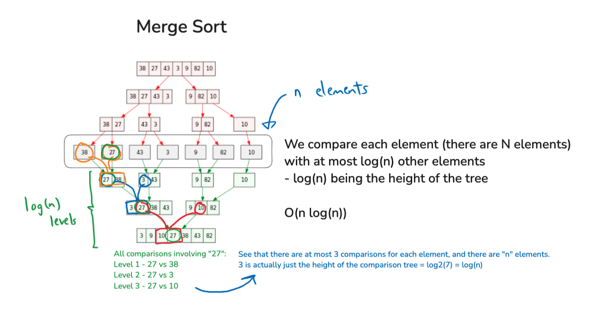
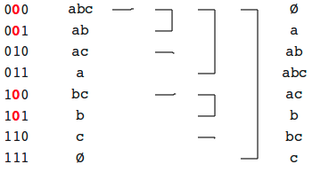
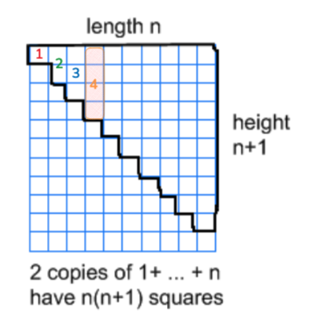
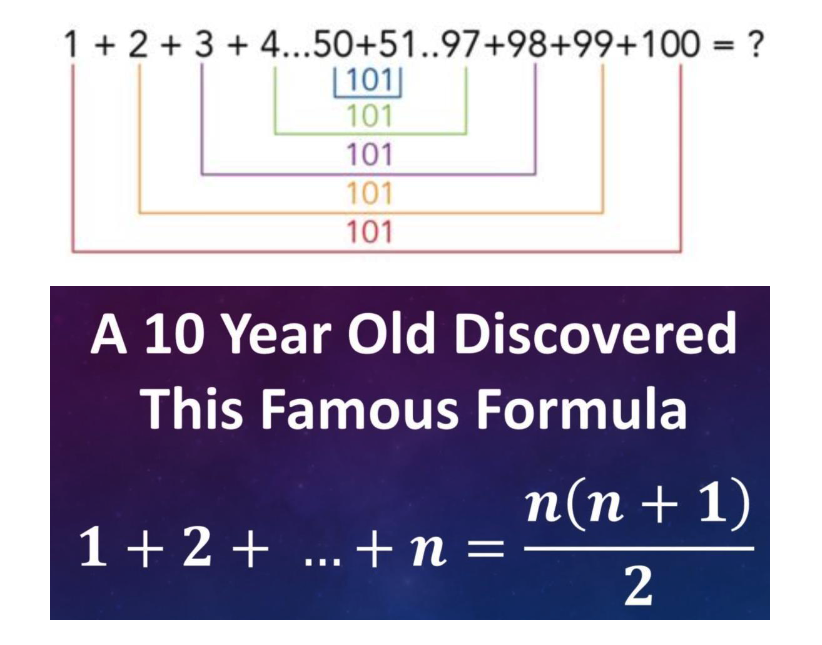
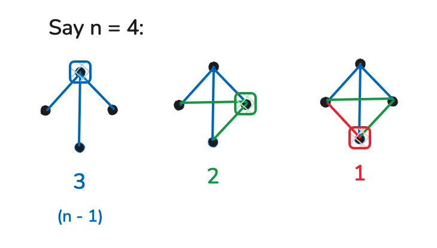

## Class Material

- You can find the source PDF document [here](./survey.pdf).
<!-- - Lecture [here](./IntroSept4.mp4) -->

---

## Merge Sort

Why is Merge Sort $O(nlog(n))$?

## Bubble Sort

The number of comparisons decreases with each iteration as the largest elements "bubble" to the end of the list. Because of this, the runtime complexity of bubble sort should surely be less than $n^2$?

However, despite this, **bubble sort's worst-case time complexity remains $O(n^2)$**, and here's why.

### Breakdown of Bubble Sort's Behavior:

- In **bubble sort**, for each pass through the array, adjacent elements are compared and swapped if necessary. After each pass, the largest unsorted element is placed at its correct position at the end of the list.
- After the first pass, the largest element is in place, meaning we don't need to compare that element in the next pass.
- As you observed, the number of comparisons decreases with each pass:
  - First pass: $n - 1$ comparisons
  - Second pass: $n - 2$ comparisons
  - And so on, until the last pass requires just 1 comparison.

### Total Number of Comparisons:

The total number of comparisons made across all passes can be calculated by summing up the comparisons for each pass:

$(n - 1) + (n - 2) + \dots + 1 = \frac{n(n - 1)}{2}$

See the [summation formula](#summation) below. This sum simplifies to $\frac{n^2 - n}{2}$, which is still $O(n^2)$ when considering asymptotic complexity.

## Binary Search

How fast can a given integer be found in a **sorted** array of $n$ integers?

**Answer**: $O(log(n))$. Using binary search on a sorted array, the search scope reduces by half of the previous search scope with each pass. It's the inverse of $2^n$, which is $log_2(n)$

:::tip Aside

- In a linked list, even with sorted elements, the search time is $O(n)$.
- Ths is because linked lists have no constant access time.

:::

## Subsets

How many subsets are there in a set of $n$ elements?

**Answer**: $2^n$. Use bit-strings to solve this problem (1 = element included in the set, 0 = not).

If I want to count number of subsets with a given number of elements (e.g. count number of subsets with exactly 3 elements), use $nCr$.

## Summation {#summation}

### Using geometry:

The total number of squares in the region highlighted in black is what we're interested in counting. That is, $length \times height \times \frac{1}{2}$.

### Using some 10-year-old's sorcery:

## Graphs

How many edges can a simple graph with n vertices can have?

### Using the [summation formula](#summation):

$$
\begin{align}
3 + 2 + 1 &= \sum_{i=1}^{n - 1}{i} \\
&= \frac{(n - 1)((n-1) + 1)}{2} \\
&= \frac{n(n - 1)}{2}
\end{align}
$$

### Using combinatorics:

In a simple graph with $ n $ vertices, each pair of distinct vertices can be connected by at most one edge. This means the maximum number of edges occurs when every vertex is connected to every other vertex.

The total number of ways to choose 2 vertices from $ n $ vertices **(i.e., the number of pairs of vertices)** is given by the binomial coefficient:

$$
\binom{n}{2} = \frac{n(n-1)}{2}
$$

Thus, the maximum number of edges in a simple graph with $ n $ vertices is $ \frac{n(n-1)}{2} $.
