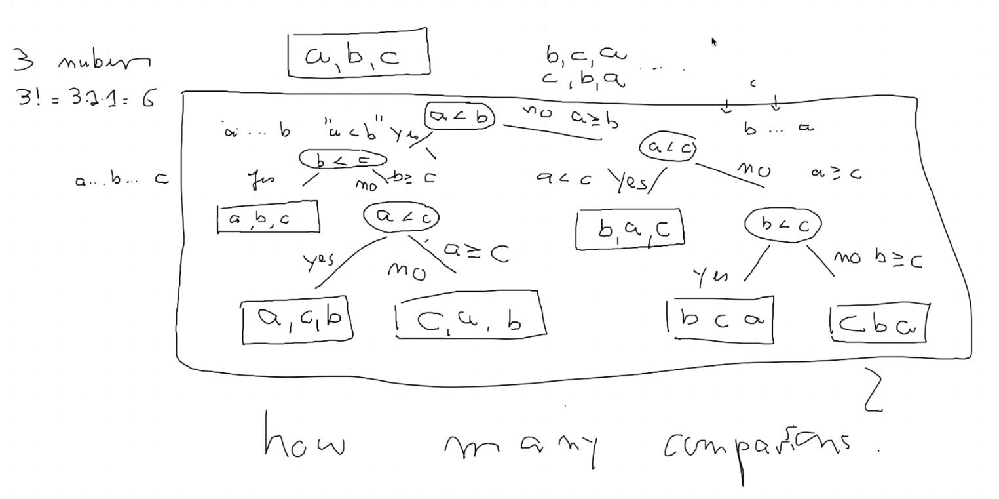
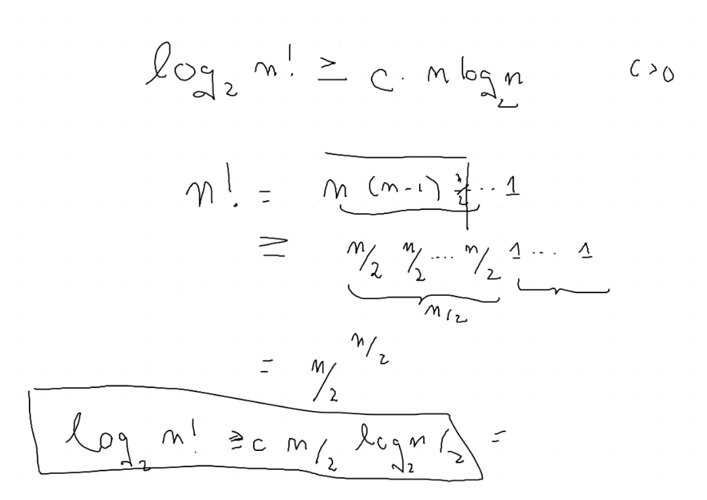

## Class Material

- Slides can be found [here](../slides2.pdf).
<!-- - Lecture can be found [here](./MergeSortD&CLowerboundSept16.mp4) -->

---

## Notations: Big-O vs. Little-o

In computational complexity theory, **Big-O** (denoted as $O(\cdot)$) and **Little-o** (denoted as $o(\cdot)$) are both used to describe the growth rates of functions, but they differ subtly in **how tightly they bound the growth of one function relative to another**. Below is a detailed comparison between the two:

---

### **Big-O Notation (O)**
- **Definition**: $f(n) \in O(g(n))$ means that **f(n) does not grow faster than g(n)** up to a constant factor for sufficiently large n.
  - There exist **positive constants** $C$ and $n_0$ such that:
    $
    f(n) \leq C \cdot g(n) \quad \text{for all} \quad n \geq n_0
    $

- **Intuition**:  
  Big-O provides an **upper bound** on the growth rate of $f(n)$. It tells us that $f(n)$ grows at most as fast as $g(n)$ asymptotically. It allows equality — meaning $f(n)$ and $g(n)$ could potentially grow at the same rate.

- **Example**:  
  $2n^2 + 3n + 5 \in O(n^2)$ because, asymptotically, $n^2$ is the dominant term (the other terms grow more slowly). So $2n^2 + 3n + 5$ does not grow faster than $n^2$.

---

### **Little-o Notation (o)**
- **Definition**: $f(n) \in o(g(n))$ means that **f(n) grows strictly slower than g(n)**, even without any constant factor.
  - Formally, for every positive constant $C$, there exists $n_0$ such that:
    $
    f(n) < C \cdot g(n) \quad \text{for all} \quad n \geq n_0
    $
  - This implies that the **ratio $f(n) / g(n) \to 0$** as $n \to \infty$.

- **Intuition**:  
  Little-o provides a **strict upper bound** on the growth rate. It says that $f(n)$ grows **strictly slower** than $g(n)$ as $n$ becomes large, and they cannot grow at the same rate.

- **Example**:  
  $n \in o(n^2)$ because $n$ grows slower than $n^2$ as $n \to \infty$. Specifically, the ratio $n / n^2 = 1/n \to 0$.

  $n^2 \notin o(n^2)$ because $n^2$ grows at the same rate as $n^2$ (not strictly slower). The ratio $n^2 / n^2 = 1$ as $n \to \infty$. *(We don't need to use L'Hôpital's Rule because it is not an indeterminate form – both the numerator and denominator grow at the same rate. Since they are identical, their ratio is always 1, no matter how large $\frac{n}{n}$ becomes.)*

:::info Application of L'Hôpital's Rule in asymptotic analysis

The expression $\frac{\infty}{\infty}$ (infinity over infinity) is considered an **indeterminate form** in calculus. This means it is not immediately clear what the value should be, and further analysis is required to evaluate it properly.

---

#### **Why is $\frac{\infty}{\infty}$ Indeterminate?**  
- **Infinity** ($\infty$) is a concept, not a real number. It indicates that a value grows without bound.
- When we encounter $\frac{\infty}{\infty}$, both the numerator and the denominator are growing indefinitely, but we don’t know how fast they grow **relative to each other**. Depending on the functions involved, the ratio could result in different outcomes:
  - **Finite value**: $ \frac{n}{2n} \to \frac{1}{2} $ as $n \to \infty$.
  - **Infinity**: $ \frac{n^2}{n} \to \infty $ as $n \to \infty$.
  - **Zero**: $ \frac{n}{n^2} \to 0 $ as $n \to \infty$.

---

#### **Resolving $\frac{\infty}{\infty}$ using L'Hôpital's Rule**  
When a limit yields the form $\frac{\infty}{\infty}$, we often apply **L'Hôpital's Rule** to evaluate it. L'Hôpital’s Rule states:

$$
\lim_{x \to \infty} \frac{f(x)}{g(x)} = \lim_{x \to \infty} \frac{f'(x)}{g'(x)},
$$

provided that both $f(x) \to \infty$ and $g(x) \to \infty$, and the derivatives $f'(x)$ and $g'(x)$ exist.

---

#### **Example Using L'Hôpital's Rule**  
Evaluate:
$$
\lim_{x \to \infty} \frac{x}{e^x}.
$$

Both the numerator $x$ and the denominator $e^x$ go to infinity, giving $\frac{\infty}{\infty}$. Applying L'Hôpital's Rule:

$$
\lim_{x \to \infty} \frac{x}{e^x} = \lim_{x \to \infty} \frac{1}{e^x} = 0.
$$

---

#### **Summary**  
$\frac{\infty}{\infty}$ is **indeterminate** because it can lead to different results depending on the growth rates of the functions involved. To resolve it, we need more information, often using tools like **L'Hôpital's Rule** or algebraic manipulation.

:::

---

### **Key Differences between Big-O and Little-o**
| **Aspect**            | **Big-O (O)**                      | **Little-o (o)**                  |
|-----------------------|------------------------------------|-----------------------------------|
| **Bound Type**        | Upper bound (not strict)           | Strict upper bound               |
| **Equality Allowed?** | Yes (same growth rate possible)    | No (strictly slower growth)      |
| **Mathematical Limit**| $ \lim_{n \to \infty} f(n) / g(n) \leq \infty $ | $ \lim_{n \to \infty} f(n) / g(n) = 0 $ |
| **Example Relationship** | $n^2 \in O(n^2)$             | $n \in o(n^2)$                 |

---

### **Summary**  
- **Big-O** notation allows for equal growth rates (or $f(n)$ can grow slower or at the same rate as $g(n)$).  
- **Little-o** notation requires that $f(n)$ grows **strictly slower** than $g(n)$.  
Both notations are useful tools in asymptotic analysis to describe how algorithms perform as input sizes grow large.

In asymptotic analysis, **$n_0$** is the threshold beyond which the behavior of the function we’re analyzing matches the specified growth bound. Essentially, it marks the point where the asymptotic relationship becomes valid.

---

:::tip **Role of $n_0$ in Asymptotic Notations**  

- When we say that $f(n) \in O(g(n))$, it means that after a certain input size $n \geq n_0$, the inequality holds:
  $$
  f(n) \leq C \cdot g(n) \quad \text{for all} \quad n \geq n_0
  $$
- For **little-o** notation $f(n) \in o(g(n))$, the idea is that for **all positive constants $C$**, there exists an $n_0$ beyond which:
  $$
  f(n) < C \cdot g(n) \quad \text{for all} \quad n \geq n_0
  $$

#### **Intuition**
- $n_0$ ensures that the asymptotic behavior is true only for **large enough input sizes**. For smaller values $n < n_0$, the functions may behave unpredictably, but asymptotic notations focus on **large $n$**.

---

#### **Example**
Say we claim that $f(n) = 3n + 2 \in O(n)$.  
- For small $n$, the $+2$ term might dominate. However, for large enough $n$, $3n + 2$ behaves similarly to $3n$.  
- In this case, $n_0$ would be the point where $3n + 2 \leq C \cdot n$ for some constant $C$. For example, with $C = 4$, we can say that the inequality holds for $n \geq n_0 = 2$.

---

#### **Summary**
- $n_0$ is the starting point beyond which the asymptotic bound (like $O(g(n))$ or $o(g(n))$) reliably holds.
- Asymptotic notations don't care about small inputs—only **what happens as $n \to \infty$** matters. $n_0$ ensures that we focus on that asymptotic behavior.

:::

---

## Sorting Algorithms

### Merge Sort

**Resources**

- [Why is Merge Sort $O(n \log n)$?](https://www.youtube.com/embed/alJswNJ4P3U?si=MMk1sfJOx87FQG8K)

**Lemma: No sorting algorithm can sort $n$ arbitrary numbers in $o (n \log n)$ comparisons**

- This means that Merge Sort is **optimal** in terms of the number of comparisons it makes.

### Comparison Trees

In the slides: Using **Comparison Trees** to describe any comparison-based algorithm.

- The height of the tree represents the number of comparisons made by the algorithm: $\log(n)$.

  > To arrive at a **specific leaf**, which is the correct result – a sorted permutation, we've only had to traverse at worst the max height of the tree.

- The number of leaves represents the number of possible outcomes: $n!$. *(For example: $\{a, b, c\}$ has $3!$ possible permutations)*

:::note Note

- These assume that the tree is a **binary tree**.
- Comparisons have exactly 2 results: **"$a < b$"** or **"$a >= b$"**.

:::

### Showing that Comparison Trees are $\Omega(n \log n)$

To show that $ \log_2(m!) $ is $ \Omega(n \log n) $ without using Stirling's approximation, we need to lower bound $ \log_2(m!) $ and compare it asymptotically with $ n \log n $.

---

#### Step 1: Express $ \log_2(m!) $
We start with the definition of the factorial's logarithm:

$$
\log_2(m!) = \log_2(1 \cdot 2 \cdot 3 \cdots m).
$$

Using the logarithm of a product:

$$
\log_2(m!) = \log_2(1) + \log_2(2) + \log_2(3) + \cdots + \log_2(m).
$$

---

#### Step 2: Lower Bound $ \log_2(m!) $
Notice that the sum $ \log_2(1) + \log_2(2) + \cdots + \log_2(m) $ can be lower-bounded by focusing on the second half of the terms (those from $ m/2 $ to $ m $):

$$
\log_2(m!) \geq \sum_{k = m/2}^m \log_2(k).
$$

> **Tip:** We can do this *magic step* of focusing on the second half because of the "$\geq$" sign. We're looking for a lower bound, so we can ignore the first half of the terms. For graphical intution, the prof's half-baked example here might help, though it is not entirely complete.

Since for all $ k $ in this range, $ k \geq m/2 $, we can lower bound each $ \log_2(k) $ by $ \log_2(m/2) $:

$$
\log_2(m!) \geq \sum_{k = m/2}^m \log_2\left(\frac{m}{2}\right).
$$

There are $ m - m/2 + 1 = m/2 + 1 $ terms in this sum, so:

$$
\log_2(m!) \geq \left(\frac{m}{2} + 1\right) \log_2\left(\frac{m}{2}\right).
$$

---

#### Step 3: Simplify the Lower Bound
We simplify the expression $ \left(\frac{m}{2} + 1\right) \log_2\left(\frac{m}{2}\right) $. For large $ m $, the term $ +1 $ is insignificant, so:

$$
\log_2(m!) \geq \frac{m}{2} \log_2\left(\frac{m}{2}\right).
$$

Using $ \log_2\left(\frac{m}{2}\right) = \log_2(m) - \log_2(2) = \log_2(m) - 1 $, we get:

$$
\log_2(m!) \geq \frac{m}{2} \left(\log_2(m) - 1\right).
$$

For large $ m $, the $ -1 $ becomes negligible, so:

$$
\log_2(m!) \geq \frac{m}{2} \log_2(m).
$$

---

#### Step 4: Compare with $ n \log n $
Now we want to compare $ \log_2(m!) $ with $ n \log n $. If we set $ m = n $, the lower bound becomes:

$$
\log_2(n!) \geq \frac{n}{2} \log_2(n).
$$

This shows that $ \log_2(n!) $ grows asymptotically at least as fast as $ \frac{n}{2} \log_2(n) $, which is clearly $ \Omega(n \log n) $. Therefore:

$$
\log_2(m!) = \Omega(n \log n).
$$

---

#### Conclusion
We have shown that $ \log_2(m!) $ is $ \Omega(n \log n) $ without using Stirling’s approximation by directly analyzing a lower bound of the sum $ \log_2(1) + \log_2(2) + \cdots + \log_2(m) $.

## Master Theorem

**Resources**

- [What is Master Theorem](https://youtu.be/2H0GKdrIowU)
- [Proof of Master Theorem](https://youtu.be/LlFBRDO5gNQ)

:::tip Aside

- If you're having a hard time understanding the proof for Master Theorem, watching the Merge Sort video first will 100% help.

:::
