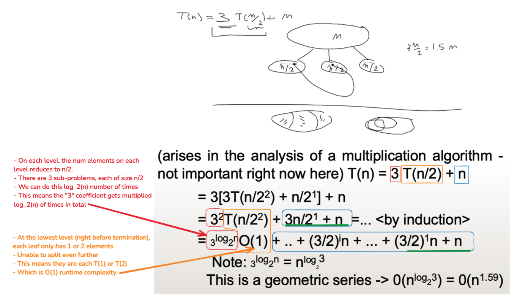
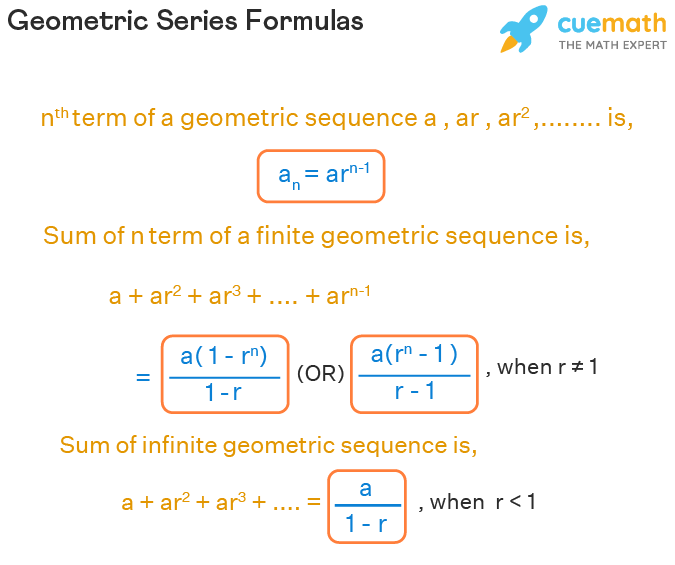
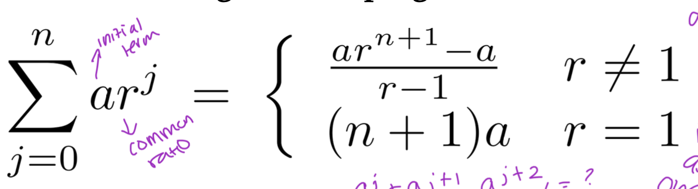

## Class Material

- Slides can be found [here](../slides2.pdf).
<!-- - Lecture can be found [here](./RecurrecnesSept18.mp4) -->

---

### Geometry Series Formulae

<!-- #### Infinite Geometric Series

$\sum\limits_{k = 1}^\infty {ar^{k - 1} = \frac{a}{{1 - r}}}$ -->

---

## Solving Recurrences

### 1. Logarithm Rules and Geometric Series

*Check slides: example with $O(n^{\log_2{3}})$ becoming $O(n^{n^{1.59}})$*

### 2. Guessing and Substitution, then prove by induction 

$T(n) = T(n-1) + n$

We guess that: $T(n) \leq cn^2$ *(this is our induction hypothesis)*

$$
\begin{aligned}
T(n) &\leq cn^2 \\
T(n-1) &\leq c(n-1)^2
\end{aligned}
$$

We assume that $T(n) \leq cn^2$ is true, and we have to prove that $T(n-1) \leq c(n-1)^2$ still works.

<!-- $$
\begin{aligned}
T(n) &= T(n-1)+n \\
T(n-1) &= T(n-2)+(n-1) \\
&= T(n-2)+n-1
\end{aligned}
$$ -->

$$
\begin{aligned}
T(n-1) &\leq c(n-2)^2+n-1 \\
&\leq cn^2-4nc+4c+n-1 \\
&\leq cn^2-4c(n-1)+n-1
\end{aligned}
$$

As long as $c<\frac{1}{4}$ and $n>1$, $cn^2-4c(n-1)+n-1$ will be less than $cn^2$.

> Hint: Solve $-4c(n-1)+n-1>0$

See that:

$$
\begin{aligned}
cn^2-4c(n-1)+n-1 &\leq cn^2 \\
\end{aligned}
$$

Which means that $T(n-1) \leq c(n-1)^2$ is true.

$\therefore$ By induction, $T(n) \leq cn^2$ is true.

:::info Pro-tip

In a recurrence of this form:

$$
T(n) = a \cdot T(z \cdot \frac{n}{b}) + f(n)
$$

As long as $\frac{z}{b} < 1$, the recursion will **converge** *(problem size decreasing)*.

For example:

- $T(n) = T(\frac{5n}{2}) + n$ will **diverge**. This is $O(\infty)$.
- $T(n) = 5T(\frac{2n}{3}) + n^2$ will **converge**. We can solve this recurrence with the Master Theorem.

:::

### 3. Master Theorem

*Check slides: Master Theorem v1 for Big-Oh and v2 for Big-Theta*

- Use intuition to understand the 3 cases of Master Theorem...
- Which part of the recursion dominates, and why? (leaves dominates, vs work per level dominates, etc)

### ?. Recursion Tree

How does this work?