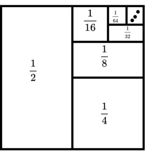

## Class Material

- Slides can be found [here](../slides2.pdf).
<!-- - Lecture can be found [here](./OrderStatsSept23.mp4) -->

---

### **Geometric Series**
A geometric series is given by:

$$
\sum_{i=0}^{\infty} ar^i = a + ar + ar^2 + ar^3 + \dots
$$

This series **converges** if the absolute value of the common ratio \(|r| < 1\). The sum of the infinite series is:

$$
\sum_{i=0}^{\infty} ar^i = \frac{a}{1 - r} \quad \text{(for } |r| < 1 \text{)}
$$

:::info Some very common applications

- $\sum_{i=0}^{\infty} \left(\frac{1}{2}\right)^i = 1 + \frac{1}{2} + \frac{1}{4} + \dots = 2$.

- $\sum_{i=1}^{\infty} \left(\frac{1}{2}\right)^i = \frac{1}{2} + \frac{1}{4} + \frac{1}{8} + \dots = 1$

- See the image below for visual intuition. The total area of the square is 1.

This proof explains why

$$
T(n) = T(\frac{n}{2}) + O(n)
$$

runs in $O(n)$ time.

Need more proof? Check out [this](https://en.wikipedia.org/wiki/1/2_%2B_1/4_%2B_1/8_%2B_1/16_%2B_%E2%8B%AF) Wikipedia article.

:::

### Linear Time Median Finding (Median of Medians)

:::info Magic

- This algorithm can also be used to find any **kth smallest element** in an array!
- It is a **divide and conquer** algorithm.

:::

Check out this article to understand how this algo works:

- https://rcoh.me/posts/linear-time-median-finding/

**Median of Medians** runs in $O(n)$ time, while **QuickSelect** runs in **expected** $O(n)$ time.