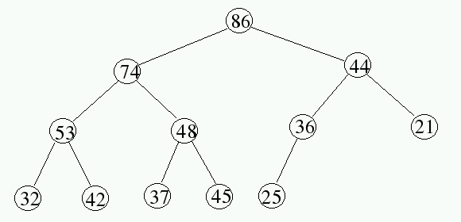

## Class Material

- Slides can be found [here](../slides2.pdf).
<!-- - Lecture can be found [here](./OrderStatsSept23.mp4) -->

---

### Why total number of leaves = $2^{k+1} - 1$

$$
\left.
\begin{array}{c}
1 \\
\\
2 \quad\quad\quad 2 \\
\\
4 \quad\quad 4 \quad\quad 4 \quad\quad 4 \\
\\
8 \quad 8 \quad 8 \quad 8 \quad 8 \quad 8 \quad 8 \quad 8
\end{array}
\right\}
\quad \text{height, 0-indexed} = k
$$

---

$$ \underbrace{8 \quad 8 \quad 8 \quad 8 \quad 8 \quad 8 \quad 8 \quad 8}_{\text{Last layer (leaves)}} \quad | \quad 4 \quad 4 \quad 4 \quad 4 \quad 2 \quad 2 \quad 1 $$

Number of leaves $=$ Total number of nodes in all layers above

### Min/Max Heap

#### Heap Shape

**Holes** always appear in the last layer, and they are always to the right of the last node in the last layer.

#### Order of Operations

When modifying a heap, always **(1) Update the structure** and **(2) Fix the heap property**, in that specific order. That is, when deleting a node, first replace the node with the last node in the heap, then fix the heap property **(trickle down)**. When inserting a node, first insert the node at the end of the heap, then fix the heap property **(bubble up)**.

#### Operation Complexities

- **Create a heap (Heapify)**: $O(n)$ - This is the reason we use **Heaps** instead of **Binary Trees** in the first place. Enough structure to get things done, and not enough structure to bog us down.
- **Insert**: $O(\log n)$ - Bubble up touches only it's own path to the root, which is the height of the tree.
- **Delete**: $O(\log n)$ - Trickle down touches only it's own path to the last layer, which is the height of the tree.
- Find Min/Max: $O(1)$ - The root of the heap.

#### Traversing a Heap

> Watch out for 0-based or 1-based indexing errors!

- Get to parent: $\lfloor \frac{n}{2} \rfloor$
- Get the left child: $2n$
- Get the right child: $2n + 1$
- Get to a position, n. (using bitstring):
  1. Construct bitstring using binary representation of n.
  2. Ignore the leftmost bit.
  3. If the $i^{th}$ bit is 0, go left.
  4. If the $i^{th}$ bit is 1, go right.
  5. Start at the root, and follow the bitstring.