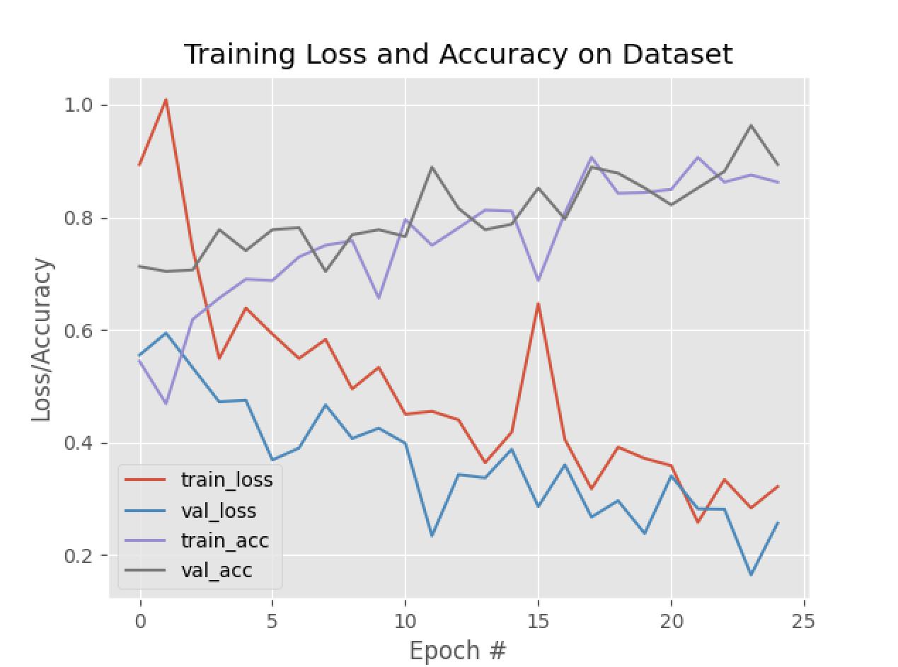

**Binary Classification of Safe and Risky Driving**

The first version of DriveSafe was very crude. I found this [pyimagesearch article](https://pyimagesearch.com/2019/07/15/video-classification-with-keras-and-deep-learning/), and thought it was acceptable to use the code as a base to bootstrap the project.

I did not have a very complete understanding of every line of the code, however I was able to grasp the high-level concepts behind it at the time. Though I just wanted to get something working, this was crucial to the success of the project.

## Categories

- v1 was very basic and had only a binary feature set: `safe` and `risky`.

## Demo

import demoVid from './demo.mp4';

<video style={{width: "100%"}} controls>
  <source src={demoVid}/>
</video>

---

In this demo, I had set the prediction averaging algorithm deque to size of 1 (meaning that there was no flickering-averaging of predictions). This was because I wanted to see the raw output of the model.

## Improvements

- You might already have noticed in the demo that due to the nature of the model not capturing the temporal features of the data, the predictions are **very jittery and not very reliable**.
- Especially for features such as **lane weaving**, it would be hard for _even a human_ to determine if the driver is weaving lanes or not, let alone a deep-learning model that is trained on relatively scarce data.
- **The solution**: On further research, I had discovered the [LSTM layer](https://keras.io/api/layers/recurrent_layers/lstm/) (which is a type of RNN) that could be used in conjuction with the ResNet50 CNN to capture both the temporal and image features of the data.

## Training Plot



### Hyperparameters

- **Batch Size**: 32
- **Epochs**: 25

```python
opt = SGD(learning_rate=1e-4, momentum=0.9, decay=1e-4 / args["epochs"])
model.compile(loss="categorical_crossentropy", optimizer=opt,
	metrics=["accuracy"])

print("[INFO] training head...")
H = model.fit(
	x=trainAug.flow(trainX, trainY, batch_size=32),
	steps_per_epoch=len(trainX) // 32,
	validation_data=valAug.flow(testX, testY),
	validation_steps=len(testX) // 32,
	epochs=args["epochs"])
```

## Dataset

- This was a very simple model that was trained on a very small dataset of **688 images (risky)** and **700 images (safe)**.
- The rationale behind selecting this number of images _(around 700 per category)_ is that I was following as closely to the pyimagesearch article as I could, and this was the number of images they used in their dataset.
- https://www.kaggle.com/datasets/voidranjer/drivesafe/data

## Model

- https://www.kaggle.com/models/voidranjer/drivesafe


## Code

- Frame Extraction
- Model Training
- Predicting
- All code can be found here: https://github.com/voidranjer/DriveSafe

---

## Footnotes

Some important changes that were made to the code (from the pyimagesearch article):

- `lr` is named `learning_rate` in the new Tensorflow update
- `.h5` or `.keras` format is used to save the model instead of `model.save(args["model"], save_format="h5")`
- Changed the loss function type to support binary categories following this StackExchange post: https://stackoverflow.com/questions/61742556/valueerror-shapes-none-1-and-none-2-are-incompatible