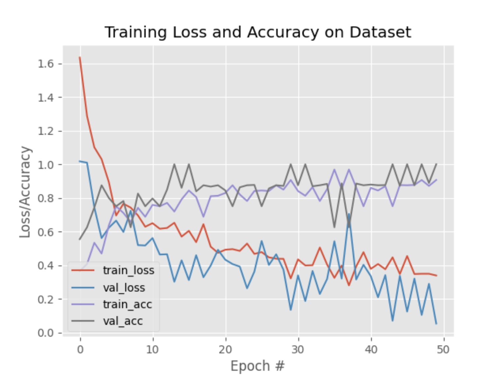

**Multi-Class Classification of Safe and Risky Driving, with incorrectly-selected validation data**

DriveSafe v2 was just built on top of v1, but instead of having just 2 categories of `safe` and `risky`, we introduced a few more categories to make the model more robust.

The main premise was that the model would be able to predict more than just `safe` and `risky` driving, but also be able to predict if the driver was tailgating, weaving lanes, etc.

:::tip Novelty

- These were features that would remain undetectable by conventional car sensors such as accelerometers and gyroscopes, but could be **detected through video footage by a camera/dashcam**.

:::

However, as explained in [this sub-page (v2 – Validation Error)](../02-validation-error/index.md), the training plot of this version of the model has been **found to be invalid**, stemming from that fact that training loss was higher than the validation loss, was pointed out by our mentors in the [Mentor Feedback section](#mentor-feedback).

**Read the [v2 – Validation Error page](../02-validation-error/index.md) to learn more about this discovery, and the subsequent investigation and hypothesis that followed.**

## Categories

- `safe`
- `collision`
- `tailgating`
- `lane weaving`

## Demo

import demoVid from './demo.mp4';

<video style={{width: "100%"}} controls>
  <source src={demoVid}/>
</video>

---

The triggered labels are displayed on the center-right of the video, and the cumulative count of each label is displayed in an animated matplotlib graph on the bottom-right.

## Improvements

- Unreliable training plot due to incorrect validation data selection.
- Added multiple categories but still missing temporal data in the model.

## Training Plot



### Hyperparameters

- **Batch Size**: 32
- **Epochs**: 50

```python
opt = SGD(learning_rate=1e-4, momentum=0.9, decay=1e-4 / args["epochs"])
model.compile(loss="categorical_crossentropy", optimizer=opt,
	metrics=["accuracy"])

print("[INFO] training head...")
H = model.fit(
	x=trainAug.flow(trainX, trainY, batch_size=32),
	steps_per_epoch=len(trainX) // 32,
	validation_data=valAug.flow(testX, testY),
	validation_steps=len(testX) // 32,
	epochs=args["epochs"])
```

## Resources

| **Resource** | **Platform** |                              **Link**                             |
|:------------:|:------------:|:-----------------------------------------------------------------:|
|     Code     |    GitHub    |          [Link](https://github.com/voidranjer/DriveSafe)          |
|     Model    |    Kaggle    |     [Link](https://www.kaggle.com/models/voidranjer/drivesafe)    |
|    Dataset   |    Kaggle    | [Link](https://www.kaggle.com/datasets/voidranjer/drivesafe/data) |

## Mentor Feedback

![Labeling features manually sounds quite tedious but overall it makes sense given the initial dataset size. Parsing the curves without the context is a bit difficult but one thing which draws my attention is the train loss being larger than validation. While it’s more common to have the opposite relationship (i.e. train loss smaller than the validation), train loss could be larger than validation in some cases (e.g. when random sampling is used somewhere in the model). In any case, I would suggest to double-check that the curves are correct. A sanity check which is sometimes helpful when you start to work on a project is to make sure that a network could overfit to a train set with few examples (e.g. 1-5) and that the validation loss is high when such overfitting happens.](slack_screnshot.png)


> ~ [Alex Pashevich](https://www.linkedin.com/in/alexpashevich/), ML Researcher at [Borealis AI](https://www.borealisai.com/)
