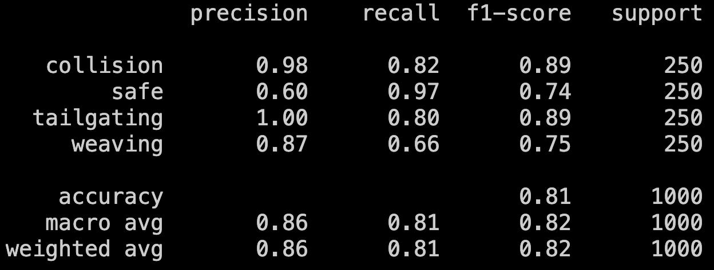
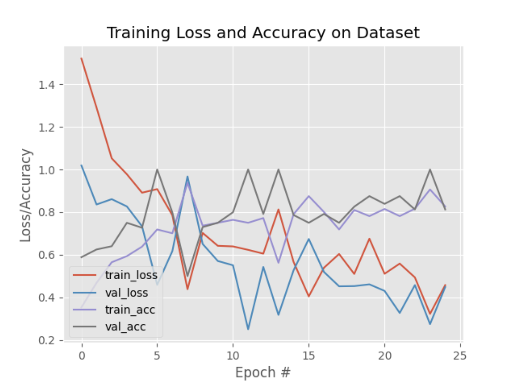
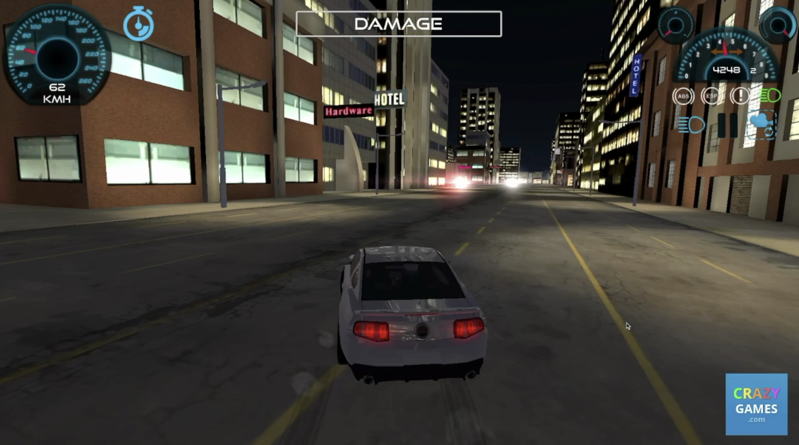

To evaluate the performance of a model, we take to the training and validation loss diagrams, and perform an analysis such as the one highlighted [in this article](https://www.baeldung.com/cs/training-validation-loss-deep-learning#:~:text=At%20times%2C%20the%20validation%20loss,and%20hence%20generates%20large%20errors.).

Some common problems identifiable from these graphs:

- **Overfitting**: If the training loss is significantly lower than the validation loss, the model is likely overfitting the training data.
- **Underfitting**: If both the training and validation losses are high, the model is likely underfitting the data.

However, the issue we faced was that the _training loss was higher than the validation loss_. This is unusual, and such a graph isn't very helpful at telling us if the model is learning anything at all.

## Investigation

From our plot, we can see that the **training loss is higher than the validation loss**.

This means that the model is performing better on the validation data than on the training data, which is unusual. Typically, the **training loss should be lower than the validation loss**, as the model is trained on the training data and should perform better on it (the model has never seen the validation data prior).

As Alex mentioned [here](../01-intro/index.md#mentor-feedback), this could be due to **random sampling** or other factors in the model that are causing this behavior. To investigate, we'll try to overfit the model on a small subset of the training data (10 samples per category instead of 1000) and see if the validation loss overtakes the training loss (as a quick sanity check).

If it does, then it could have been one of the factors mentioned above. But if it does not, then it's a sign that we may be doing something wrong earlier in our training process.

### Overfitting Test Results





We reduced the num_epochs to just 25 (instead of 50), and selected the first 10 frames of each video as raw data. (which, in hindsight, was a terrible choice of selecting and filtering data).

The graph above shows the training and validation loss for the overfitting test.

- ✅ Training and validation losses are **similar** (which is usually a sign of good fit)
- ❌ Training loss is **still higher** than the validation loss (no change from previous tests)
- ❌ Both training and validation losses are **high** (indicating underfitting/model not learning from the data)

This result indicates a potential problem with the input data, as we all know: **"Garbage in, garbage out"**.

## Hypothesis

After consulting with our AI mentors from Borealis AI [Yongmin](https://www.linkedin.com/in/yongminyan/) and [Nene](https://www.linkedin.com/in/neneazu/), it was theorized that the problem could be with the way we are splitting the data into training and validation sets.

```python title="train.py" {4}
# partition the data into training and testing splits using 75% of
# the data for training and the remaining 25% for testing
(trainX, testX, trainY, testY) = train_test_split(data, labels,
	test_size=0.25, stratify=labels, random_state=42)
```

In the [train.py](https://github.com/voidranjer/DriveSafe/blob/main/train.py) script used to create the model, see that we have used `train_test_split` to split the data into training and testing sets.

The `train_test_split` function from scikit-learn shuffles the data before splitting it, randomly picking data points from the sample set to create the training and testing sets.

That much is obvious. What's not obvious, though, is that **the data points are essentially screenshots of consecutive frames of a video recording** (taken at a calculated interval).

Take a look at the two images below:




Can you spot the difference between these images? The reason why they look so similar is because they are just **consecutive frames from the same video recording**.

The first image may have been chosen to be in the training set, while the second image may have been chosen to be in the validation set. But since they are so similar, **the validation set is essentially a subset of the training set**.

This is bad because the model is essentially being tested on data that it has already seen during training. The training plot that is produced then becomes unreliable, and it becomes non-trivial to analyze the model's progress from looking at the graphs.

### Fixing the Issue

To fix this issue, we need to ensure that the training and validation sets are **exclusive of each other**. This means that the validation set should contain data that the model has never seen before during training.

Instead of dropping down a sequence of images from the sample set and having the training script shuffle and randomly select images to be validation data, we'll instead **manually record a different set of data to be used as the validation set by hand**.

For example, we could record driving footage on Street A to be used as the training set, and then record driving footage on Street B to be used as the validation set.

We may elect to use data like this (unique background buildings, etc):


to be used in the validation set, instead of using the second image from the previous example.

weaving gets triggered more
