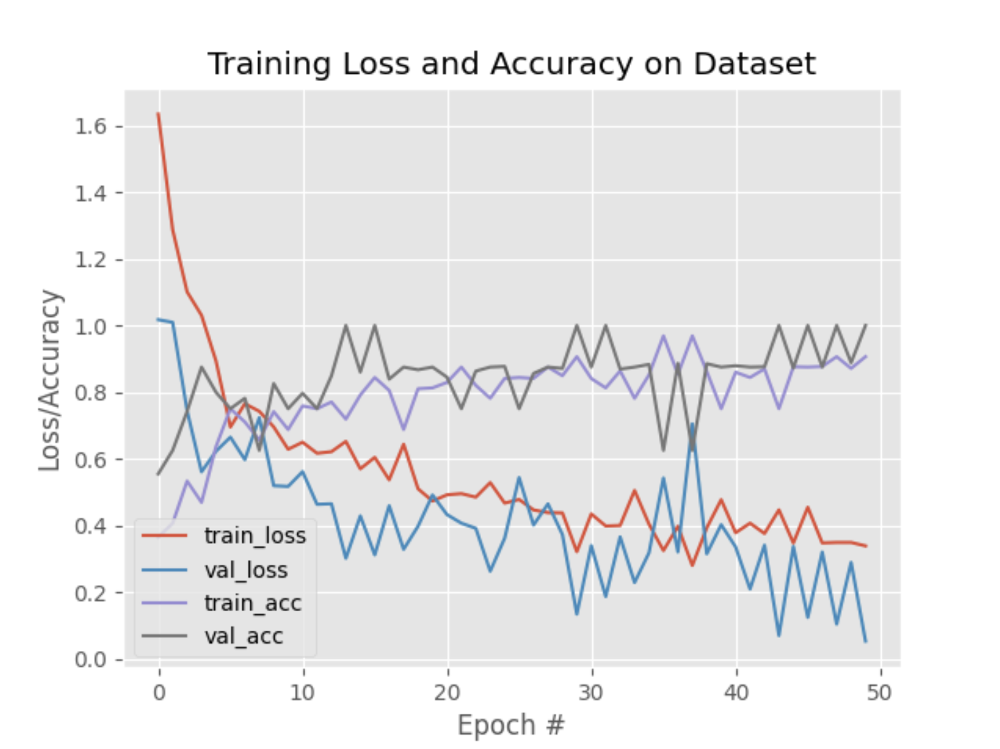
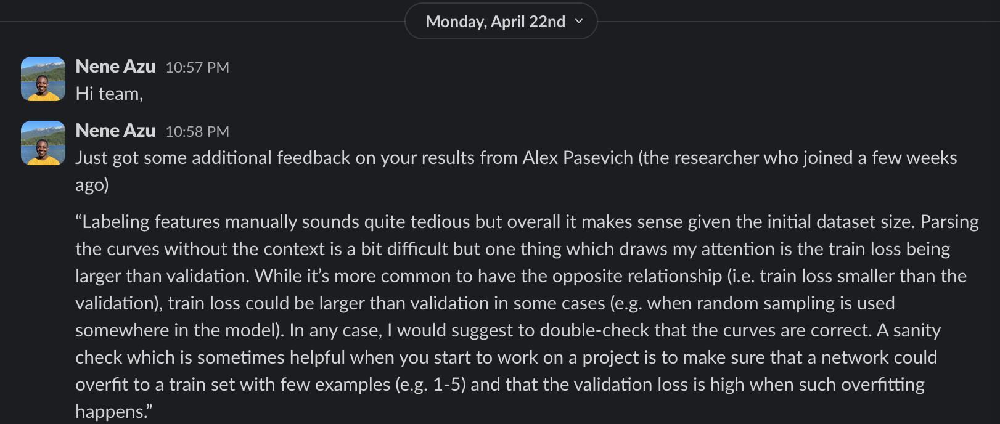

## Training Plot

### Understanding the Training Plots

In the context of machine learning, specifically in the training of neural networks, **"training loss"** and **"validation loss"** are two important metrics used to assess the performance of the model during training.

**Training Loss**

- Training loss, also known as the empirical loss or objective function, is a measure of how well the model is performing on the training data. It quantifies the error between the predicted output of the model and the actual target output for the training examples.
- The goal during training is to minimize this loss, which is typically achieved through optimization algorithms like gradient descent. Lower training loss indicates better performance of the model on the training data.

**Validation Loss**

- Validation loss is similar to training loss, but it is calculated on a separate dataset called the validation dataset. During training, after each epoch _(a complete pass through the training dataset)_, the model's performance is evaluated on the validation dataset by calculating the validation loss.
- This helps in assessing how well the model generalizes to unseen data. If the model performs well on the training data but poorly on the validation data, it might be overfitting, meaning it's memorizing the training data rather than learning to generalize from it.

The aim is to have both training and validation losses low and close to each other, indicating that the model is learning to generalize well from the training data.

## Mentor Feedback

> "Labeling features manually sounds quite tedious but overall it makes sense given the initial dataset size. Parsing the curves without the context is a bit difficult but one thing which draws my attention is the train loss being larger than validation. While it’s more common to have the opposite relationship (i.e. train loss smaller than the validation), train loss could be larger than validation in some cases (e.g. when random sampling is used somewhere in the model). In any case, I would suggest to double-check that the curves are correct. A sanity check which is sometimes helpful when you start to work on a project is to make sure that a network could overfit to a train set with few examples (e.g. 1-5) and that the validation loss is high when such overfitting happens."
>
> ~ [Alex Pashevich](https://www.linkedin.com/in/alexpashevich/), ML Researcher at [Borealis AI](https://www.borealisai.com/)
