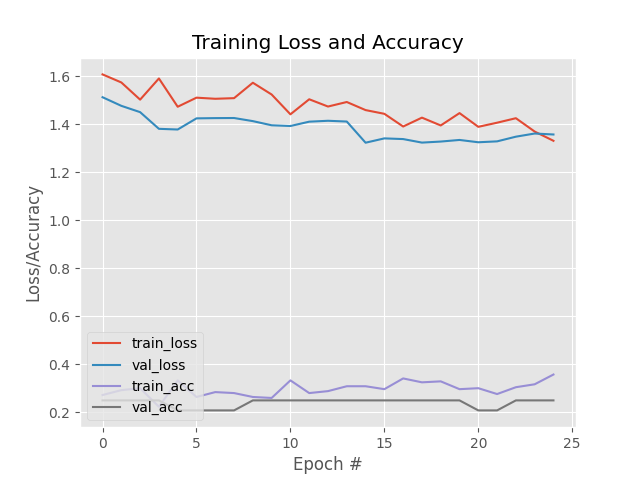

**Driving Risk Evaluation from Video Input using AI with temporal data training using LSTM**

:::tip Earlier Versions

Issues with [DriveSafe v2](../06-v2/01-intro/index.md):

- 👍 Really good at identifying **collisions** and **tailgating**.
- 🤮 Absolutely miserable in telling the difference between **safe driving** and **lane-weaving**.

:::

**DriveSafe v3**'s main goal was to improve the model's ability to **differentiate between safe driving and lane-weaving.** To do this, we added an LSTM layer to the model to capture the temporal features of the data.

To understand this concept, take a look at both videos below:

---

import safeVid from './safe.mov';
import weavingVid from './weaving.mov';

<video style={{width: "100%"}} controls>
  <source src={safeVid}/>
</video>

<video style={{width: "100%"}} controls>
  <source src={weavingVid}/>
</video>

---

**Notice how easy it is to distinguish between the two videos. The first video shows a driver driving safely, while the second video shows a driver weaving lanes.**

This would be a significantly harder task for a deep-learning model to accomplish, especially if it's only trained on images (independent freeze-frames) and not the temporal features of the data.

## Demo

import demoVid from './demo.mp4';

<video style={{width: "100%"}} controls>
  <source src={demoVid}/>
</video>

---

Bad results despite the model being trained on a larger dataset. The model was still **underfitting** the data, and the model was not learning from the data.

## Challenges

- In one of the iterations of DriveSafe v3, we had an **unbalanced amount of input data** (the "collision" had way fewer sequences than other categories).
- This led to the model being **biased** towards the categories with more data, and the "collision" category is rarely triggered.

## Training Plot

See that the model was still severely **underfitting** the data. This was a sign that the model was not learning from the data, and that the model was not complex enough to capture the features of the data.

One of the methods we employed to try and attack this was by increaasing the NUM_EPOCHS from 25 to 150, and BATCH_SIZE from 32 to 2084.

However, this was to no avail, as the model was still underfitting the data.

## Improvements

The theory is that the model was **not complex enough** to capture the features of the data. This is why the model was underfitting the data.

When training v3, I had uprooted the entire training process and started from scratch. This included the removal of the `ResNet50` layer from the process. **This was a mistake.** It will be corrected in [DriveSafe v4](../08-v4/01-intro/index.md).

## Resources

| **Resource** | **Platform** |                              **Link**                             |
|:------------:|:------------:|:-----------------------------------------------------------------:|
|     Code     |    GitHub    |          [Link](https://github.com/voidranjer/DriveSafe)          |
|     Model    |    Kaggle    |     [Link](https://www.kaggle.com/models/voidranjer/drivesafe)    |
|    Dataset   |    Kaggle    | [Link](https://www.kaggle.com/datasets/voidranjer/drivesafe/data) |