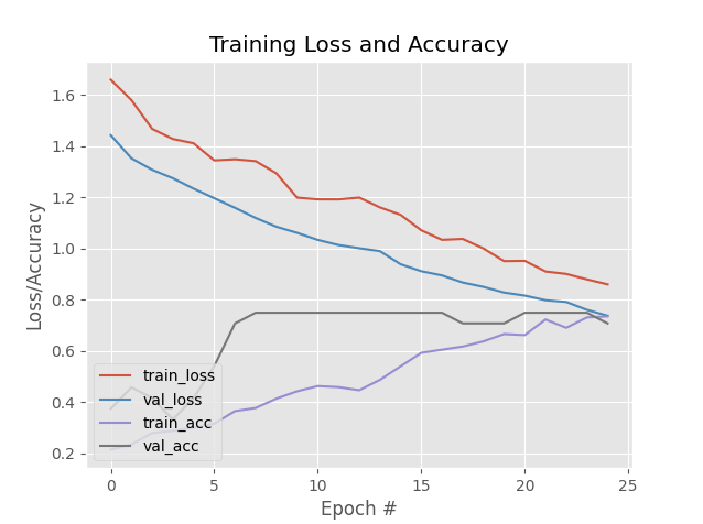

The video input used in this demo is the exact same video as the one used in the [DriveSafe v3 demo](../../07-v3/index.md#demo). However, you can already see the massive quantum leap in performance between the two models.

## Training Plot

Just a couple of observations, `val_acc` seem to plateau around the 7 epochs mark, which could be a sign of **underfitting**. However, `train_loss` and `val_loss` seem to be continuously decreasing, which is a good sign.

## Resources

| **Resource** | **Platform** |                              **Link**                             |
|:------------:|:------------:|:-----------------------------------------------------------------:|
|     Code     |    GitHub    |          [Link](https://github.com/voidranjer/DriveSafe)          |
|     Model    |    Kaggle    |     [Link](https://www.kaggle.com/models/voidranjer/drivesafe)    |
|    Dataset   |    Kaggle    | [Link](https://www.kaggle.com/datasets/voidranjer/drivesafe/data) |